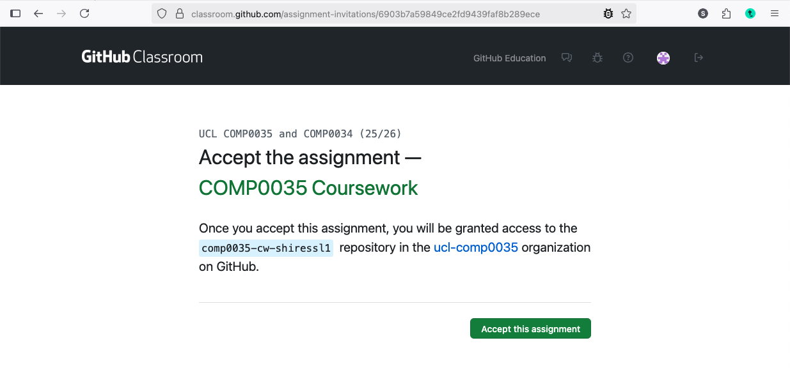
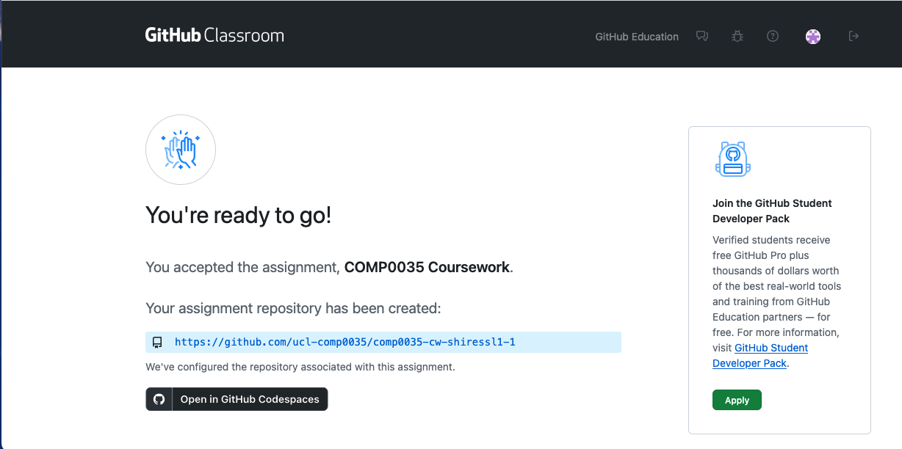

# 5. Set up the coursework project

You can use the same project for coursework 1 and 2 so you only need to do this once.

GitHub Classroom provides a way for you to create repository so that it can then be accessed by yourself, the course
tutor and PGTAs.

All coursework repositories for COMP0034 and COMP0035 are created using GitHub Classroom.

You click on a URL that creates a copy of a template repository with some starter files that you will need for the
coursework.

Repositories that are created this way are stored in an organisation called **ucl-comp0035**, not in your personal
GitHub account. They are created as **private** which in this case means _you, the course tutor and PGTAs_ can see
your code; but other students cannot.

## Create the repository

1. Login to [GitHub](https://github.com/login)
2. After you log in, click on this practice GitHub classroom assignment
   link: [https://classroom.github.com/a/XDkrDasZ](https://classroom.github.com/a/XDkrDasZ)
3. The first time that you use GitHub classroom you need to:
    - authorise your GitHub account to use GitHub Classroom
    - join the organisation that owns the classroom, **ucl-comp0035**
    - If you see the following please authorise the classroom:

   

    - If you see the following then click on the green button to join the organisation:

   You should see something similar to the following:

   

4. Press ‘Accept this assignment’.

   It may take a minute for the repository to be created, and you may need to refresh the browser page to see when it
   has finished.

   Once finished it will look something like this:

   

If you click on the link it should go to the newly created repository.

Note: The 'Open in Codespaces' button allows you to work with the code in an online version of the VS Code IDE instead
of on your computer.

## Accessing the repository

This repository is in the ucl-comp0035 organisation and NOT in your personal GitHub account.

The URL to access it will be something like this but with your GitHub username at the end:
`https://github.com/ucl-comp0035/comp0035-cw-yourgithubusername`

If you joined the ucl-comp0035 organisation then you can also find it through your GitHub page going to the top right
menu and selecting 'Organisations'.

## Create the project in your IDE

Use the instructions in activities 3 and 4 to:

- Clone the repository from GitHub to your IDE
- Create and activate a venv
- Install the requirements and the code: `pip install -e .` (you don't need to do `pip install requirements.txt` as well
  as pyproject.toml has the dependencies listed)

## Make a change and push that change to GitHub

Now that you have a local copy and a remote copy on GitHub, learn how to keep your files in synch.

Open the README.md file and add a line of text. You can write anything. Save the file.

Create a new python file in the coursework 1 folder, e.g. data_prep.py and write a 1 line comment in it.

You now need to:

- **add** or **stage** the new Python file so that git knows it should be tracked (your IDE may have prompted you to do
  this when you saved the new file)
- **commit** the changes and add a **commit message** to say what the change is e.g. "Practice commit"
- **push** or **sync** the changes with GitHub

The instructions for this differ by IDE:

- [VS Code](https://code.visualstudio.com/docs/sourcecontrol/overview#_commit)
- [PyCharm](https://www.jetbrains.com/help/pycharm/commit-and-push-changes.html#commit)

## Make a change on GitHub and pull the change to your IDE

This step is optional.

You can edit code on GitHub directly. If you do this then you need to pull changes from GitHub to your local computer.

- Find the repository on GitHub.
- Click on the README.md file
- Use pencil icon to open in Edit mode.
- Add some text
- Select the 'commit changes' button
- Edit the commit message if you wish, then press 'commit'
- Now go to your IDE and find the option to 'pull', 'fetch' or 'synch' changes

    - [VS Code](https://learn.microsoft.com/en-us/azure/developer/javascript/how-to/with-visual-studio-code/clone-github-repository?tabs=activity-bar)
    - [PyCharm](https://www.jetbrains.com/help/pycharm/sync-with-a-remote-repository.html#fetch)

## Conflicts

If you edit the same file on your local repo and the remote repo then when you try to pull/push/sync you will get a
merge conflict. This means that git will need you to decide which version of the changes to keep.

Again, how you deal with this varies by IDE.

Typically, IDEs provide a view that shows both versions of the file and indicates the lines that are different
and will have a mechanism that allows to select which version to keep.

- [VS Code](https://code.visualstudio.com/docs/sourcecontrol/overview#_merge-conflicts)
- [PyCharm](https://www.jetbrains.com/help/pycharm/resolve-conflicts.html)