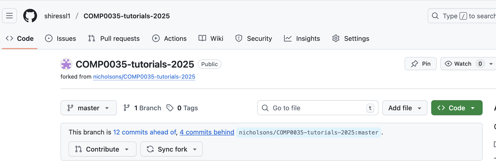
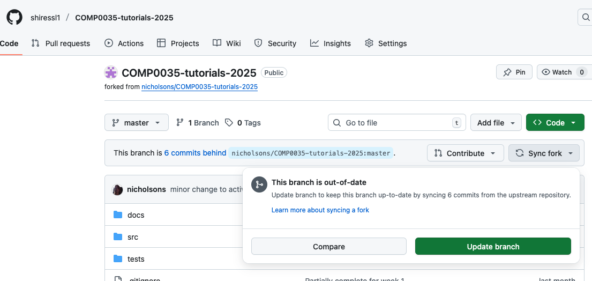

# Instructions and pre-requisites

_*Theme: Working with code for applications*_

## Pre-requisites

### 1. Update the forked tutorials repository

Login to GitHub and navigate to your forked copy of
the [COMP0035 tutorials 2025 repository](https://github.com/nicholsons/COMP0035-tutorials-2025).

Check whether any changes have been made. For example, the image below shows 4 new commits have been made to the
original.

If changes have been made, you will need to update your forked repository.

Click on the "Synch fork" button; and then on "Update branch".

Now, open your IDE (VS Code, PyCharm) and update the local copy of the repository. This assumes you have integrated your
IDE with your GitHub account in week 1. You may be prompted to log in to GitHub before you can carry out the
following.

- In PyCharm try menu option Git > Pull
- In VS Code click on the source code control icon on the left side panel, then when the source code control pane opens,
  click on the three dots and select Pull.

There are other methods, look in the Help for either PyCharm or VSCode.

## Activities

The activities this week focus on actions that can be taken to improve the quality of your code. That is, actions that
do not affect the functionality of the code, only how it is written and structured.

The activities centre around the concept writing 'clean code'. Code is considered clean if it can be understood easily
by yourself and other developers. Code that is easier to understand is easier to read, change, extend and maintain by
anyone (not just the author).

Robert Martin's book Clean Code describes practices that help a programmer to write clean code, these include:

- Follow standard conventions (style guides, syntax)
- Create expressive variable and function names
- Keep it simple, avoid complexity
- Write modular code and practice DRY (Don't Repeat Yourself (DRY) in The Pragmatic Programmer by Andy Hunt and Dave
  Thomas)
- Document your code

The activities this week concentrate practical steps you can take in your work that help to achieve this.

Note that the quality of your code is considered throughout the coursework in this module and in COMP0034.

The activities this week are shorter. Use remaining time to complete any outstanding activities from week 2.

UPDATE: If you are using VSCode to open markdown files, please refer
to [their documentation](https://code.visualstudio.com/docs/languages/markdown#_markdown-preview) for how to view the
rendered page rather than the raw markdown.

1. [Docstring](3-01-docstrings.md)
2. [Linting](3-02-linting.md)
3. [Auto-formatting](3-03-formatter.md)
4. [GitHub Actions lint report](3-04-github-actions.md)
5. [(Optional) Static analysis: beyond linting](3-05-static-analysis.md)
6. [Project structure](3-06-project-structure.md)
7. [Imports](3-07-imports.md)
8. [Error handling](3-08-error-handling.md)

## Further reading

- [How to write clean code](https://www.freecodecamp.org/news/how-to-write-clean-code/)

