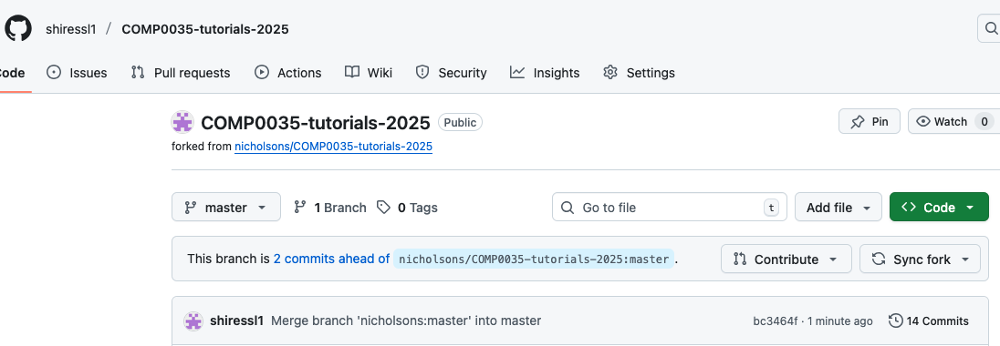
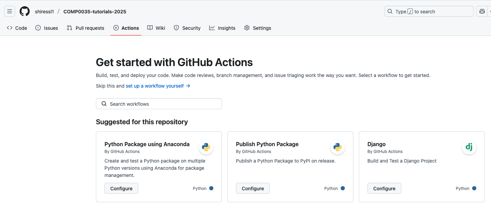
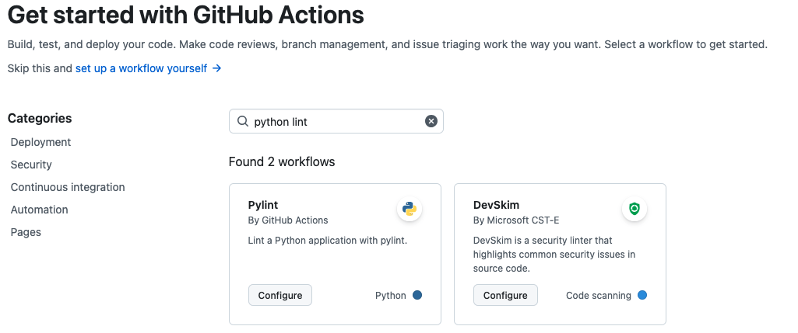
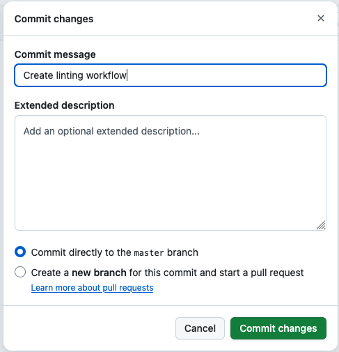
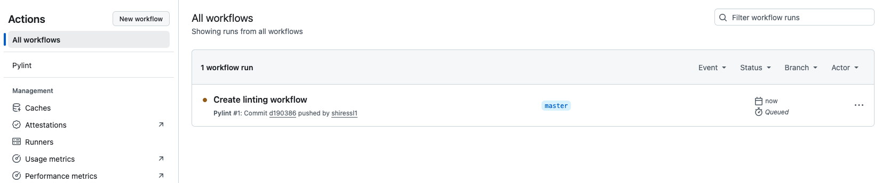
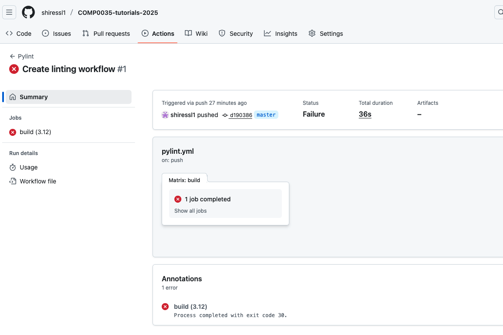

# 4. GitHub Actions workflow to automate linting

[GitHub Actions](https://docs.github.com/en/actions) is a GitHub feature that allows you run automated workflows on
your repository code using a virtual server within the GitHub ecosystem. For example, a workflow that runs a linter or
static analyser and reports the results every time you push your code changes to GitHub.

GitHub provides templates for different starter templates, there is often one that is close to what you want.

## Create a workflow for the tutorial project

1. Navigate to your forked copy of the repository on GitHub. Mine looks like this:

   
2. Find the Actions menu link and click on it. You can see it in the image above near the top. This takes you to a view
   that lets you create a new workflow or select to copy an existing template.
   
3. Add `python lint` to the search bar and enter. Choose the 'Pylint' by clicking on it's `Configure` button.

   
4. This will generate a copy of the template which is in a format called YAML. You probably need to edit this. Below I
   have added comments to suggest what you should change:

    ```yaml
   name: Pylint   # Optional change. Name of the workflow that will appear in your workflow list.

    on: [push]   # Do not change. Tells GitHub to run this workflow when changes are pushed to repository.
    
    jobs:
      build:
        runs-on: ubuntu-latest   # Optional change. Specifies the server to run the code on. You can change to windows or mac if you wanted. See https://github.com/actions/runner-images for the options.
        strategy:
          matrix:
            python-version: ["3.8", "3.9", "3.10"]  # Suggested change. List of python versions to run the workflow on. Set here to run 3 times on 3.8, 3.9, 3.12. Suggest you set this to match your venv, likely 3.12 or 3.13
        steps:  # Do not change. List of steps that the workflow carries out. Checks out your code, sets up the environment with the specified python version(s)
        - uses: actions/checkout@v4
        - name: Set up Python ${{ matrix.python-version }}
          uses: actions/setup-python@v3
          with:
            python-version: ${{ matrix.python-version }}
        - name: Install dependencies  # Required change. Install dependencies. Add the last line "pip install -e ." as this is not in the template.
          run: |
            python -m pip install --upgrade pip
            pip install pylint                    
            pip install -e .    
        - name: Analysing the code with pylint  # Optional change. Runs the pylint and checks all python files. You can change it to lint specific folders/files. You can also add steps to run other tools, try adding flake8 or ruff.
          run: |
            pylint $(git ls-files '*.py')

    ```
   Once you have made the changes you need, select the green `Commit changes...` button in the top right.
5. Select 'Commit changes' again on the next window.

   
6. The workflow `.yml` is now added to a `.github` folder within your project files. Adding this file and commiting it in
   the last step caused a 'push' on the repo so it immediately runs the workflow. Select Actions from the menu at the
   top. The workflow is running, the status can be amber (in the screenshot) which means it is running, green it ran
   successfully, or red it ran but issues were found.

   
7. Click on the highlighted name of the workflow (in the image above it is "Create linting workflow"). This opens that
   run of the workflow and shows the status of each job, the following only has one job as I only configured the
   workflow to run on Python 3.12 and not multiple versions. Click on the job name, in the below image it would be '1
   job created'.

   
8. You can now see a report. The section headings map to the step descriptions that were in the .yml file. If you expand
   the red X button you can see what the issue is - it failed the linting (this is due the deliberate issues in one of
   the activity starter code files).

This activity gave you a basic linting workflow. There are many options you can configure and more steps that can be
added. Refer to the [GitHub Actions documentation](https://docs.github.com/en/actions/how-tos) for more information.

[Next activity](3-05-static-analysis.md)