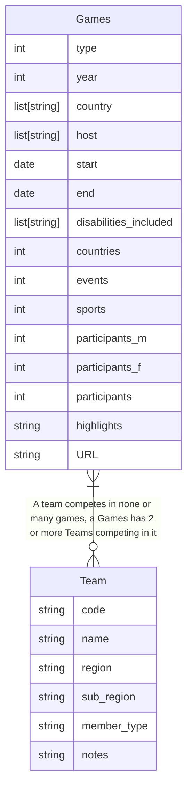

# 3. Conceptual database design

In this activity you will complete the conceptual design stage for a database based on the `paralympics_raw.csv` and
`npc_codes` data files.

To view the mermaid code in this markdown file as diagrams in your IDE, you need
to [install the Mermaid plugin for your IDE](https://mermaid.js.org/intro/getting-started.html#_3-using-mermaid-plugins).

The conceptual design can be hand-drawn on paper; it does not have to be digital.

## Conceptual design

Goal: Create a high-level data model that captures the data requirements.

Output: An Entity-Relationship (ER) model.

Focus: What data should be stored, and the relationships between data items.

## Step 1 List the attributes

Refer to [activity 2.02 pd.read_excel](../2_pandas/2-02-pandas-df.md)
and [activity 2.03 pandas.columns](../2_pandas/2-03-pandas-describe.md) for guidance.

You may want to create a new package folder in 'src/activities' for the database work e.g. 'src/activities/db'.

1. Create a python module e.g. database_design.py

2. You can either import and use the code in `from activities.starter.starter_db import read_raw_excel` or copy it to
   your own module. Use the code to:

    - Read the Excel version of the raw data file `data/paralympics_all_raw.xlsx`, create one dataframe for the
      `sheet_name="events"` and another for `sheet_name="country_codes"`
    - Print information about the data such as columns, datatypes and unique values of columns

## A description the attributes

Brief description of the attributes for reference.

Games:

- 'type': Type of Paralympics (summer or winter)
- 'year': Year of the event
- 'country': Country where the event was held
- 'host': Host city
- 'start': Start date of the event
- 'end': End date of the event
- 'disabilities_included': A list of strings, the disability categories included in the games. One of:  'Spinal
  injury', '
  Amputee', 'Vision Impairment' 'Les Autres', 'Cerebral Palsy', 'Intellectual Disability', 'Cerebral'
- 'countries': Number of participating countries
- 'events': Number of events within the event (e.g. Women's 400m Freestyle - S9, Men's 100m Butterfly - S14, etc.)
- 'sports': Number of sports included in the event
- 'participants_m': Number of male participants
- 'participants_f': Number of female participants
- 'participants': Total number of participants

Country code:

- 'Code': National Paralympic Committee (NPC) code for the competing team
- 'Name':    Name of the country
- 'Region': NPC definitions of regions. One of: 'Asia', 'Europe', 'Africa', 'America', 'Oceania', or can be
  empty if member type is construct
- 'SubRegion': NPC definitions of subregions. One of:  'South, South-East', 'North, South, West', 'North', 'West,
  Central', 'Carribean, Central', 'South','East', 'Oceania', 'West','Central, East', or empty if MemberType is construct
- 'MemberType': Type of the competing team, one of: 'country', 'team', 'dissolved', 'construct'
- 'Notes': Any text notes on the record.

## List potential entities

The data lists details about paralympic games. 'ParalympicGames', or 'Games', is an entity.

You also have details about paralympic country codes for each paralympics team. 'Team', is another entity.

There appears to be a relationship between Games host and Team given that they are linked by country name. However, the
relationship is more accurately that one Games has many Teams competing in it, and a Team may compete in many Games.

You may have noticed that in 1984 there were two host cities in two countries: Stoke Mandeville, UK and New York, USA

The diagram below uses the Mermaid tool which draws ER diagrams in a given format. Other tools may use a different
format. The detail you want to show is the entities, their attributes and any relationships between the entities.

This is now the conceptual design, it shows the entities, their attributes and any relationships between those entities.

[Next activity](4-04-logical-design-1nf.md)
