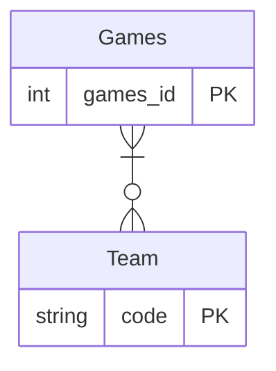
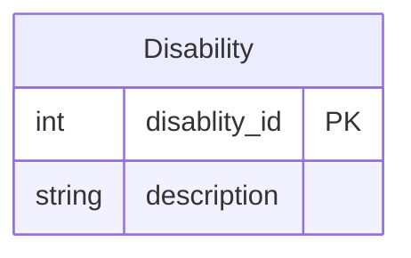
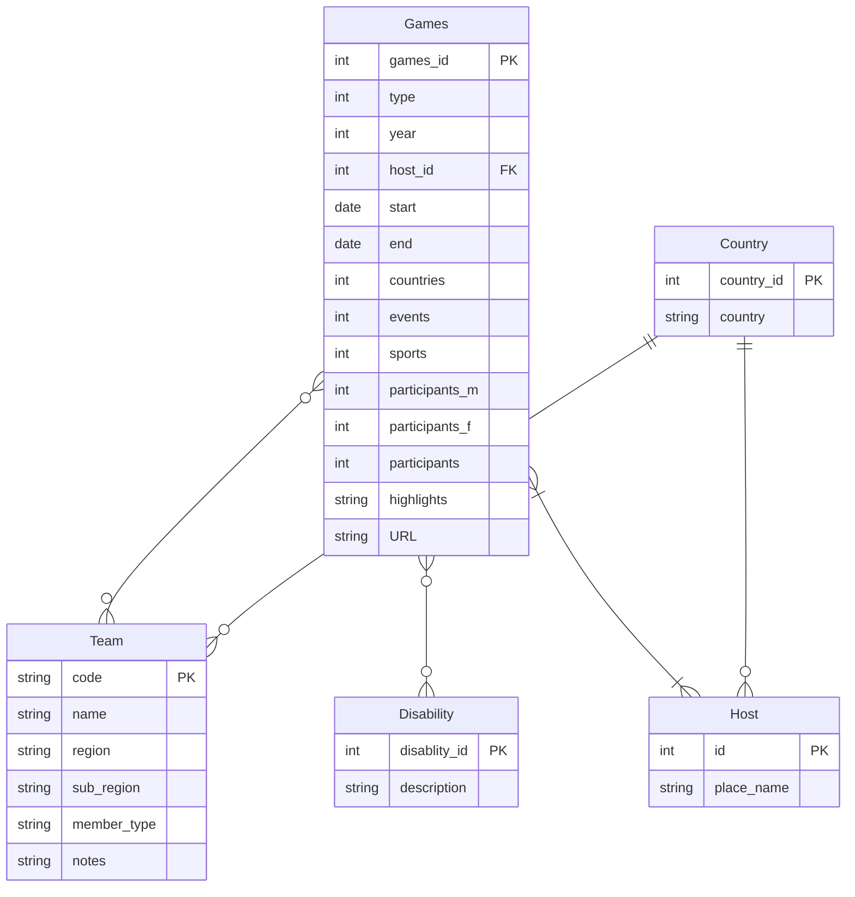
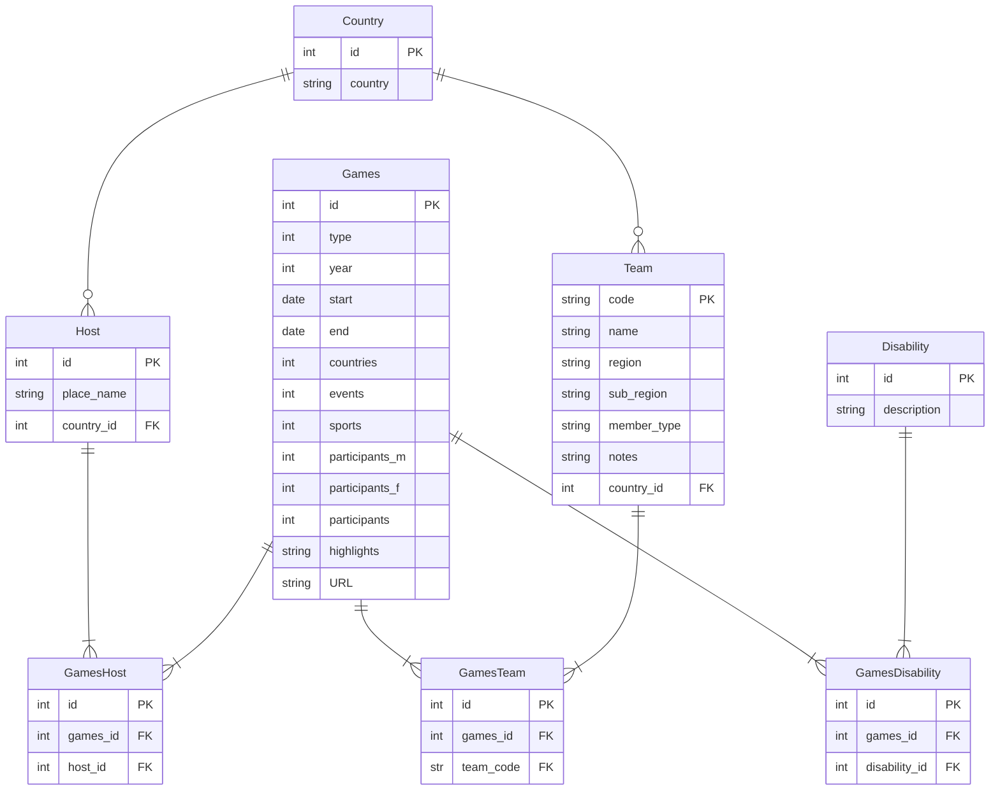

# 4. Logical database design to 1NF

This activity takes the conceptual database design and applies principles of normalisation to a level that is broadly
3NF.

## Logical database design

- Goal: Translate the conceptual model into a logical model that can be implemented in a specific type of database (
  e.g., relational).
- Output: A relational schema with tables, attributes, primary/foreign keys, and constraints. Includes normalization
  to reduce redundancy and improve integrity. Can also be drawn as an ERD.
- Focus: How the data will be structured logically, independent of any specific database management system (DBMS).

## Normalisation

Normalisation is a concept in database design aimed at ensuring that the data is stored in a structured and efficient
manner. It aims to reduce redundancy (e.g. duplicated data) and improve integrity (e.g. avoid errors being introduced
when data is added, updated or deleted).

As previously discussed, this module does not enforce a formal proof of normalisation. Instead, you are encouraged to
consider the principles below and their impact on the design or your database.

You will be designing a database for use in a web application, and are often trade-off's between database efficiency
and coding efficiency. A more complex database structure may be more efficient in terms of data redundancy and ensure
greater data integrity; however it could make querying that data to use in an application more complex. This topic is
not covered in the teaching material, you are encouraged to read wider than the course materials here to understand the
implications for your later coursework in this module and the next.

The rest of this activity walks through applying the principles of the first the levels of normalisation.

### First normal form (1NF)

A table is in 1NF if the intersection of every column and record contains only one value.

The key aspects of 1NF are:

- **Atomicity**: Every column contains only atomic (indivisible) values. This means that each field contains a single
  value, not a set of values or a list.
- **Uniqueness**: Each column must have a unique name.
- **No Repeating Groups**: There should be no repeating groups or arrays. Each row must be unique and identifiable by a
  **primary key**.

A **primary key (PK)** is an attribute (column) containing unique values so it can be used to uniquely identify a given
row.

A **composite primary key** is where a combination of two or more columns are used to uniquely identify a row.

Review the contents of the conceptual design and the dataframes against the above checklist. Note any issues as these
will need to be addressed, e.g.:

&#x274C; Atomicity. Fail. The row for 'summer 1984' contains lists for host and city as the event was held in two
locations. 'disabilities_included' also contains lists.

&#x2705; Uniqueness. Pass. Each column has a unique name.

&#x2705; No Repeating Groups: Pass. A row could be uniquely identified by a combination of the 'type' and 'year'
attributes (if the New York/Stoke Mandeville event were split into two rows). When two or more attributes uniquely
identify a row, this is called a **composite primary key**.

#### Activity: Identify primary keys (1NF)

Each row in each table must be uniquely identified.

In Team, the three-letter code uniquely identifies the rows. The code is the **primary key** attribute.

In Games, there is no single unique attribute. A combination of 'type' and 'year' could be used as a **composite primary
key**.

Integer primary keys are generally considered more efficient for indexing, and easier to refence in programme code than
a composite key, so add a new attribute `games_id`, auto-incrementing integer i.e. starts at 1 and the database
management system typically automatically increases it for each subsequent row.

You now have these primary keys (other attributes removed for simplicity):

#### Activity: Create new tables to remove the list values (1NF)

The row for Stoke Mandeville and New York has lists in 'country' and 'host'. The 'disabilities_included' also contains
lists. These break the principle of **atomicity** so must be resolved.

Create a new table for Disability. It should have a primary key and the string description of the disability e.g.

The relationship between Games and Disability can be described as a Games can provide events for many Disability
categories; and each Disability category can be in many Games. This is a **many-to-many** relationship.

One solution to the 'country' and 'host' could be to split the data into two rows, one for Stoke Mandeville and one for New York. This is
problematic as you do not have separate data on the events, participants, countries etc. for the two separate elements
of the event.

Another solution is to treat 'country' and 'host' as separate entities, i.e. create a new table for each of these.
The reason for separating them into two further tables rather than one, is that one country can have many host cities.
For example, USA has hosted events in Salt Lake City, New York and Los Angeles.

The relationship between Host and Country can be now described as: "A Country has one or many hosts, a Host is in one
and only one Country". This is a **one-to-many** relationship.

Each of the new tables needs a unique attribute as primary key, **PK**. To form the relationship with the other table,
you place the PK of the table on the one side of the relationship in the many side of the relationship where is becomes
a Foreign Key, **FK**.

The relationship between the Games and Host can now be described as: "A host can host one or many Games, and a Games can
be hosted by one or more Host city". This is a **many-to-many** relationship.

These tables now look like this:

#### Resolve the many-to-many relationships

However, there are still issues with design with repeating values for the many-to-many relationships.

A relational database does not support the many-to-many relationship so you need to add another table that 'joins' or
links the two tables. This joining table is sometimes called an 'association' table. It will have the PK of both
tables as FK attributes; often these are the only two attributes in the table and can be combined as a composite primary 
key.

The many-to-many relationships that need to be addressed:

- Games : Team
- Games : Disability
- Games : Host

This can be resolved by adding 3 new tables:

- GamesTeam
- GamesDisability
- GamesHost

[Next activity](4-05-logical-design-2nf.md)
