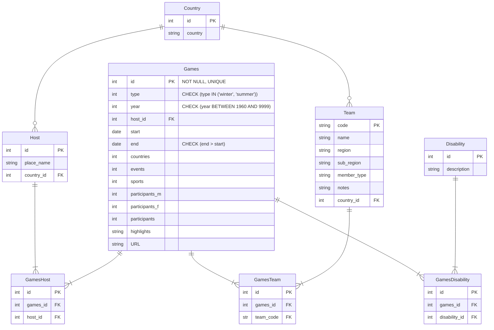

# 7. Identifying constraints

Now that you have a normalised table structure, this next step clarifies any constraints on the attributes.

Constraints include:

- validation of the data values for an attribute, e.g. allowable values, whether null is allowed
- validation on foreign keys e.g. what to do in the child table when a row in the parent table is updated or deleted.

Keys are also constraints. You have already identified Primary Key and Foreign Key constraints in the previous
activities.

## SQL data constraints

The following are common constraints that can be noted for an attribute in a SQL database:

- PRIMARY KEY: A combination of NOT NULL and UNIQUE. Uniquely identifies each row in a table.
- FOREIGN KEY: Ensures that values in a column (or a group of columns) match values in another table’s column(s),
  maintaining referential integrity.
- CHECK: Ensures that all values in a column satisfy a specific condition.
- DEFAULT: Sets a default value for a column if no value is specified.
- NOT NULL: Ensures that a column cannot have a NULL value.
- UNIQUE: Ensures that all values in a column are different. This is required for a single PK field!

## Activity: Determine the data constraints for the attributes in the paralympics data

1. Add the constraints to the ERD for the Team table. The Games table is done for you as an example.
   Note that many DBMSs automatically treat the PK field as `NOT NULL`, and `UNIQUE` so you do not need to specify this.

   e.g. for the Team table:

    - 'code': Must be 3 letters capitalised
    - 'name': Required.
    - 'region': One of: 'Asia', 'Europe', 'Africa', 'America', 'Oceania', or can be empty if member type is construct
    - 'sub_region': One of:  'South, South-East', 'North, South, West', 'North', 'West, Central', 'Carribean,
      Central', 'South','East', 'Oceania', 'West','Central, East', or empty if MemberType is construct
    - 'member_type': Type of the competing team, one of: 'country', 'team', 'dissolved', 'construct'
    - 'notes': Any text notes on the record.

[Next activity](4-08-logical-design-constraints-fk.md)