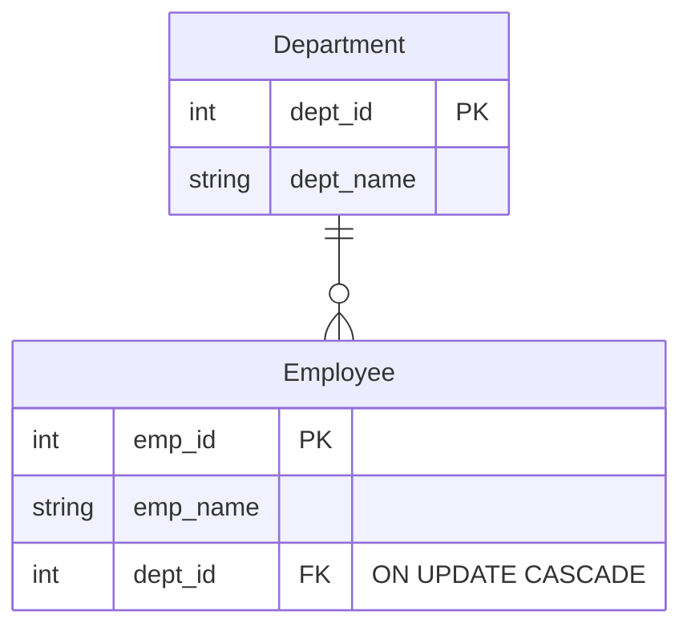
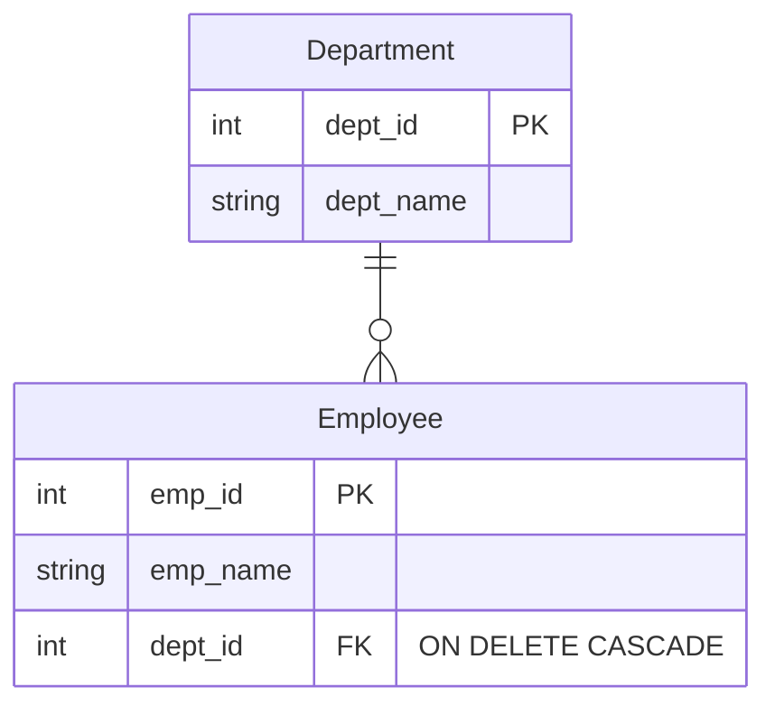
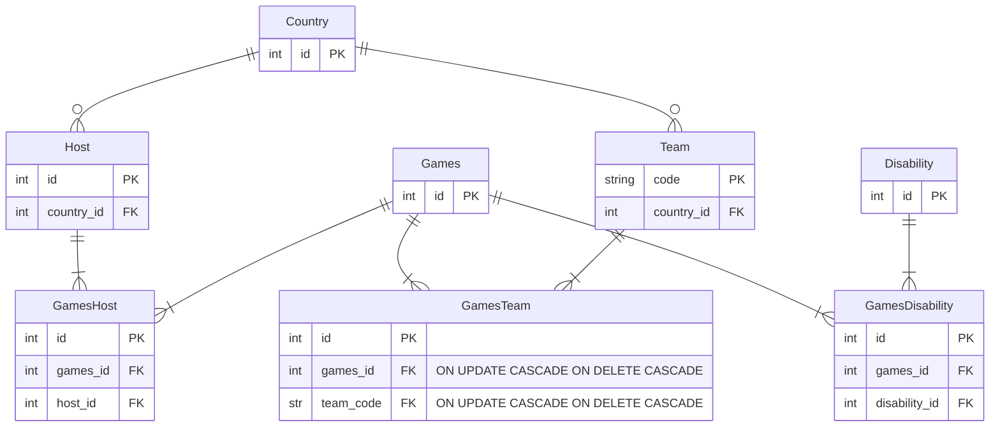

# 8. Identifying foreign key constraints

## ON UPDATE and ON DELETE actions

In relational databases, foreign key constraints help maintain data integrity when changes occur. This is referred to as
referential integrity.

The constraints cover what action the DBMS should take ON UPDATE and/or ON DELETE. If an action is not explicitly
specified, it defaults to "NO ACTION".

### Update constraints

| Constraint            | Action                                                                                                                                                                                                                                                                                                                                                                                                                            |
|:----------------------|:----------------------------------------------------------------------------------------------------------------------------------------------------------------------------------------------------------------------------------------------------------------------------------------------------------------------------------------------------------------------------------------------------------------------------------|
| ON UPDATE CASCADE     | Ensures that when a value in the parent table (the table being referenced) is updated, all corresponding values in the child table (the table with the foreign key) are automatically updated to match the new value. This is useful in scenarios where the primary key of a parent table might change, and you want to ensure that all related records in the child table reflect this change to maintain referential integrity. |
| ON UPDATE SET NULL    | Sets the foreign key in the child table to NULL if the referenced key in the parent table is updated.                                                                                                                                                                                                                                                                                                                             |
| ON UPDATE RESTRICT    | Prevents the update on the parent table if there are matching rows in the child table.                                                                                                                                                                                                                                                                                                                                            |
| ON UPDATE NO ACTION   | Similar to RESTRICT, it prevents the update but allows the action to be deferred until the end of the transaction.                                                                                                                                                                                                                                                                                                                |
| ON UPDATE SET DEFAULT | Sets the foreign key in the child table to a default value if the referenced key in the parent table is updated.                                                                                                                                                                                                                                                                                                                  |

Example of "ON UPDATE CASCADE"

Consider two tables: employees and departments. The employees table has a foreign key that references the departments
table. If the dept_id in the departments table is updated, the corresponding dept_id in the employees table will also be
updated automatically.

## Delete constraints

DELETE constraints help maintain data integrity when rows are deleted from a table.

These are the main DELETE constraints:

| Constraint            | Action                                                                                                                                                                                                                                                     |
|:----------------------|:-----------------------------------------------------------------------------------------------------------------------------------------------------------------------------------------------------------------------------------------------------------|
| ON DELETE CASCADE     | Automatically deletes all rows in the child table that have a foreign key reference to the deleted row in the parent table. Useful when you want to ensure that no orphaned records remain in the child table after a parent record is deleted.            |
| ON DELETE SET NULL    | Sets the foreign key in the child table to NULL when the referenced row in the parent table is deleted. Useful when you want to keep the child records but remove the reference to the deleted parent record.                                              |
| ON DELETE RESTRICT    | Prevents the deletion of a row in the parent table if there are matching rows in the child table. Useful when you want to ensure that no parent record is deleted if it has associated child records.                                                      |
| ON DELETE NO ACTION   | Similar to RESTRICT, it prevents the deletion of a parent row if there are matching child rows, but the enforcement can be deferred until the end of the transaction. Useful when you want to defer the integrity check until the transaction is complete. |
| ON DELETE SET DEFAULT | Sets the foreign key in the child table to a default value when the referenced row in the parent table is deleted. Useful when you want to keep the child records and set a default reference when the parent record is deleted.                           |

Example of 'ON DELETE CASCADE'

If a department is deleted, all employees in that department will also be deleted.

## Apply foreign key constraints to the paralympics tables

All non-key attributes have been removed for this exercise just to make it easier to see the attributes you need for the
constraints.

The constraints are described as:

- Games ||--|{ GamesTeam: If a Games is deleted, the GamesTeam record should also be deleted. On update, also update.
- Team ||--|{ GamesTeam: If a Games is deleted, the GamesTeam record should also be deleted. On update, also update.
- Games ||--|{ GamesDisability: If a Games is deleted, the GamesDisability record should also be deleted. On update, also update.
- Disability ||--|{ GamesDisability: If a Disability is deleted, the GamesDisability record should be deleted. On update, also update.
- Host ||--|{ GamesHost: If a Host is deleted, delete the GamesHost. On update, also update.
- Games ||--|{ GamesHost: If a Games is deleted, delete the GamesHost. On update, also update.
- Country ||--o{ Host: If a country is updated, update the host. If a country is deleted, set the host to NULL.
- Country ||--o{ Team: If a country is updated, update the team. If a country is deleted, set the team to NULL.

**Constraints are applied to the FK attributes**. For example: `int games_id FK "ON UPDATE CASCADE, ON DELETE CASCADE"`

[Next activity](4-09-logical-design-activity.md)