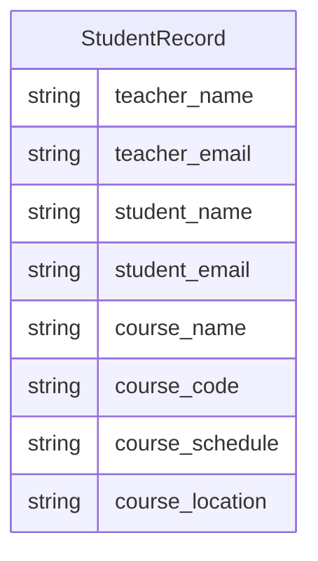

# 9. Logical design activity

The previous activities covered a lot of theory which could make this process some complicated. However, applying the
principles of normalisation for this module does require you to explicitly prove each stage of the normalisation.

Try to create a normalised design for the data below.

Take the table as shown below and consider how to split it into further tables so that:

- Repeated/duplicated data is avoided.
- Each column/row intersection has only one entry.
- Each column name is unique.
- Each row has a unique identifier, i.e., a primary key for each table.
- Tables with relationships are linked by primary key:foreign key relationships.
- Where there is a many-to-many relationship, add a new table between the two tables so forming two one-to-many
  relationships.

Draw the design however you wish e.g., on paper, using a sketch app, in PowerPoint, using a diagramming app, writing the
mermaid syntax in a markdown file, etc.

The data looks like this:

| teacher_name | teacher_email          | student_name  | student_email            | course_name | course_code | course_schedule | course_location |
|:-------------|:-----------------------|:--------------|:-------------------------|:------------|:------------|:----------------|:----------------|
| John Smith   | john.smith@school.com  | Alice Brown   | alice.brown@school.com   | Mathematics | MATH101     | Mon-Wed-Fri 9am | Room 101        |
| John Smith   | john.smith@school.com  | Bob Green     | bob.green@school.com     | Mathematics | MATH101     | Mon-Wed-Fri 9am | Room 101        |
| Jane Doe     | jane.doe@school.com    | Alice Brown   | alice.brown@school.com   | Physics     | PHYS201     | Tue-Thu 11am    | Room 202        |
| Jane Doe     | jane.doe@school.com    | Charlie White | charlie.white@school.com | Physics     | PHYS201     | Tue-Thu 11am    | Room 202        |
| Mark Taylor  | mark.taylor@school.com | Bob Green     | bob.green@school.com     | Chemistry   | CHEM301     | Mon-Wed 2pm     | Room 303        |

This has been drawn as a conceptual design, i.e. one that has not been normalised, as follows:



## Using gen-AI tools to generate a design

As a learning point it would be better to work out the design yourself, and then use gen-AI to compare its design
to your own. You would then have a basis for understanding whether what the AI produced looks reasonable. It was
clear in last year's coursework submissions where students simply used AI without checking the result as the designs
often had issues!

To use [AI](https://m365.cloud.microsoft/chat/) try copy/paste the prompt:

```text
Given the following markdown format table of data, design a database structure that is normalised to 3NF.

| teacher_name | teacher_email          | student_name  | student_email            | course_name | course_code | course_schedule | course_location |
|:-------------|:-----------------------|:--------------|:-------------------------|:------------|:------------|:----------------|:----------------|
| John Smith   | john.smith@school.com  | Alice Brown   | alice.brown@school.com   | Mathematics | MATH101     | Mon-Wed-Fri 9am | Room 101        |
| John Smith   | john.smith@school.com  | Bob Green     | bob.green@school.com     | Mathematics | MATH101     | Mon-Wed-Fri 9am | Room 101        |
| Jane Doe     | jane.doe@school.com    | Alice Brown   | alice.brown@school.com   | Physics     | PHYS201     | Tue-Thu 11am    | Room 202        |
| Jane Doe     | jane.doe@school.com    | Charlie White | charlie.white@school.com | Physics     | PHYS201     | Tue-Thu 11am    | Room 202        |
| Mark Taylor  | mark.taylor@school.com | Bob Green     | bob.green@school.com     | Chemistry   | CHEM301     | Mon-Wed 2pm     | Room 303        |
```

[Next activity](4-10-physical-design-structure.md)