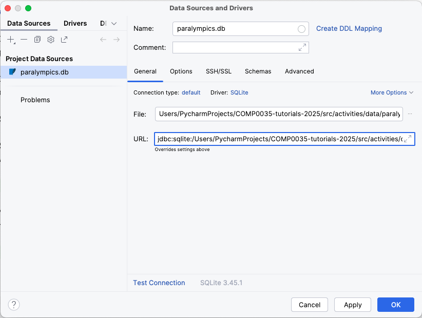
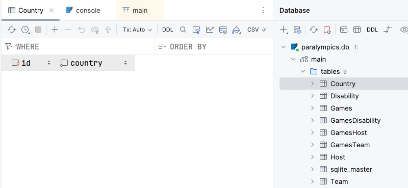

# 11. Create the paralympics database

In this activity you will create an SQLite database using Python code and the SQL schema created in the last activity.

The general approach when using sqlite3 is:

1. Create a connection: You start by connecting to a SQLite database file. If the file doesn’t exist, it will be
   created.
2. Create a cursor: A cursor is an object that allows you to execute SQL commands and fetch results from the database.
3. Execute SQL commands: Using the cursor, you can run SQL statements like creating tables, inserting data, or querying
   records.
4. Commit the transaction: If you've made changes such as creating tables or inserting data, you need to commit them to
   save the changes permanently.
5. Close the connection: Finally, you close the connection to free up resources and ensure everything is properly saved
   and shut down.

Complete the following steps:

1. Create a new function in your database module to create the database structure e.g.
   `create_db(sql_scipt_path, db_path)`
   which takes the .sql file location as an argument. You may also want to pass the file path to the database file. It
   should create a sqlite database but does not return anything from the function.
2. Use `sqlite3` which does not need to be installed, add `import sqlite3`.
3. Create a connection to the file. The general is: `connection = sqlite3.connect(db_path)`
4. Create a cursor. The syntax is: `cursor = connection.cursor()`
5. Execute the sql commands using the cursor object. The general syntax is `cursor.execute("YOUR_SQL_STATEMENT")`
   however, in this case rather than executing a single SQL statement you want to execute a series of statements
   contained in a your SQL script file, so instead use `cursor.executescript(path_to_sql_script)`
6. Commit the changes using the connection object. The syntax is: `connection.commit()`
7. Close the connection. The syntax is `connection.close()`
8. Define the sql file path and the database file path as variables, e.g. in `main`. Call the function in your code
   passing the variables as arguments. Run your code to create the database.

   NB: There is no mandatory file extension for sqlite files. By convention though they typically use `.db` or `.sqlite`
   so `paralympics.db` or `paralympics.sqlite`.

## View the database structure in VS Code or PyCharm

If you added a VS Code extension for viewing SQLite databases, you should be able to open the database file from the
project file list in VS Code by clicking on it. You should then see the table structure.

In PyCharm Professional (not available in the standard version) there is a database pane in the IDE. Select it by
clicking on the icon 

Select options to add a new data source with the type SQLite 

Select the location of the database file. If the driver at the bottom of the screen does not show as SQLite then there
will be an option to install it instead which you should select.

You can then expand the view to look at the tables, and double-click on a table to open the view of the data added to
the table.

## Activity (optional): Create a database for the student records

Use the [student_schema.sql](../../src/activities/starter/student_schema.sql) and your function to create a database
from script to create the student records database. Hopefully you wrote your function in a way that it can create any
database from any script.

[Next activity](4-12-sql-add-data.md)
