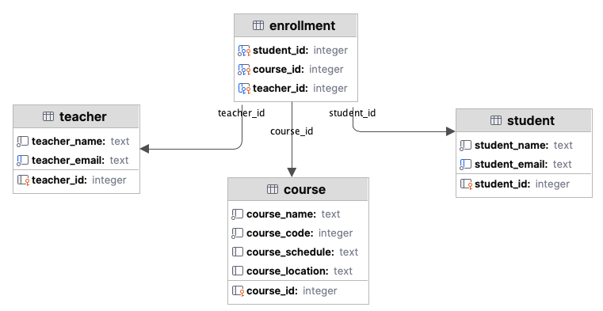

# 13. INSERT data to a table that does not have a foreign key

## INSERT syntax

The core syntax of a SQL query to insert one row of values into a table is:

```sql
INSERT INTO table_name (column_name_1, column_name_1)
VALUES (value1, value2);
```

If the table only has those two columns, then you can omit the column names like this:

```sql
INSERT INTO table_name
VALUES (value1, value2);
```

To insert multiple rows with values:

```sql
INSERT INTO table_name (column_name_1, column_name_1)
VALUES (value1, value2),
       (value1, value2),
       (value1, value2);
```

The above allow you to specify the names of the columns to insert the values, as well as the values.

You could create queries this way, save them in a .sql script and execute the script as you did for the database
creation.

This approach would be cumbersome where you have many columns and/or many values to insert.

## Using sqlite3 to insert

### Insert a single row

To insert a single row, the code structure is that used to create the database structure just with a different query.

```python
connection = sqlite3.connect(db_path)  # Create a connection to the database using sqlite3
cursor = connection.cursor()  # Create a cursor object to execute SQL commands
cursor.execute('PRAGMA foreign_keys = ON;')  # Enable foreign key constraints for sqlite

# Define the SQL INSERT query
insert_sql = 'INSERT INTO student (student_name, student_email) VALUES ("Harpreet", "harpreet@school.com")'

cursor.execute(insert_sql)  # Execute the insert query 
connection.commit()  # Commit the changes
connection.close()  # Close the connection
```

In an application you are more likely to add values generated from variables.

sqlite3 supports the use of **parameterised queries** using the generic syntax:
`cursor.execute("INSERT INTO table_name VALUES(?, ?, ?)", data)`

- Use one `?` for each of the columns in the table
- `data` is the values for each of the columns e.g. `("some_string", 7, 12.87)` and must match the same order as the
  columns in the table

If you only want to insert a value or values for a subset of columns then specify the column names, e.g.
`cursor.execute("INSERT INTO table_name (column_name2, column_name3) VALUES(?, ?)", data)`

Parameterised queries offer benefits, a key one of which is that they separate SQL code from user input as the data is
treated as values. This helps prevent SQL injection attacks (more on this next term).

An example of a single row insert:

```python
value_str = "string1"
value_int = 12
value_float = 12.01
cursor.execute("INSERT INTO table_name VALUES(?, ?, ?)", (value_str, value_int, value_float))

# The same as above, written without the variable names
cursor.execute("INSERT INTO table_name VALUES(?, ?, ?)", ("string1", 12, 12.01))

# Using specific columns only
cursor.execute("INSERT INTO table_name (name, age) VALUES(?, ?, ?)", ("string1", 12))
```

### Insert multiple rows

To insert a multiple rows instead of one, use a list of values and `cursor.executemany()`

```python
data = [
    ("string1", 12, 12.01),
    ("string2", 76, 33.07),
    ("string3", 45, 76.56),
]
cursor.executemany("INSERT INTO table_name (name, age, score) VALUES(?, ?, ?)", data)
```

## Activity: Insert a row into the student database

Using one of the methods above, insert values into the teacher, course or student database.

Choose some sample data from below:

```text
teacher_name,teacher_email,student_name,student_email,course_name,course_code,course_schedule,course_location
John Smith,john.smith@school.com,Alice Brown,alice.brown@school.com,Mathematics,MATH101,Mon-Wed-Fri 9am,Room 101
John Smith,john.smith@school.com,Bob Green,bob.green@school.com,Mathematics,MATH101,Mon-Wed-Fri 9am,Room 101
Jane Doe,jane.doe@school.com,Alice Brown,alice.brown@school.com,Physics,PHYS201,Tue-Thu 11am,Room 202
Jane Doe,jane.doe@school.com,Charlie White,charlie.white@school.com,Physics,PHYS201,Tue-Thu 11am,Room 202
Mark Taylor,mark.taylor@school.com,Bob Green,bob.green@school.com,Chemistry,CHEM301,Mon-Wed 2pm,Room 303
```

The database schema is as follows, note that the course table should really be split further but doesn't affect this
activity:


### Activity: Insert multiple rows using the data from a dataframe
For this activity, read the data into a pandas dataframe and use values in parameterised queries.

1. Write the code for the teacher, student and course tables.
    An extract of the approach for the student table:
    
    ```python
    # Code to create the connection and cursor is omitted from the excerpt, you will need it
    
    data_path = resources.files(data).joinpath("student_data.csv")
    df = pd.read_csv(data_path)
    
    # Enable foreign key constraints for sqlite
    cursor.execute('PRAGMA foreign_keys = ON;')
    
    # Define the SQL insert statements for the parameterised queries
    student_sql = 'INSERT INTO student (student_name, student_email) VALUES (?, ?)'
    
    # Create dataframe with the unique values for the columns needed for the student table (database add the PK automatically)
    student_df = pd.DataFrame(df[['student_name', 'student_email']].drop_duplicates())
    
    # Get the values as a list rather than pandas Series. The parameterised query expects a list.
    student_data = student_df.values.tolist()
    
    # Use `executemany()` with a parameterised query to add the values to the table.
    cursor.executemany(student_sql, student_data)
    ```

2. Add the code for the teacher and student tables

[Next activity](4-14-select-query.md)