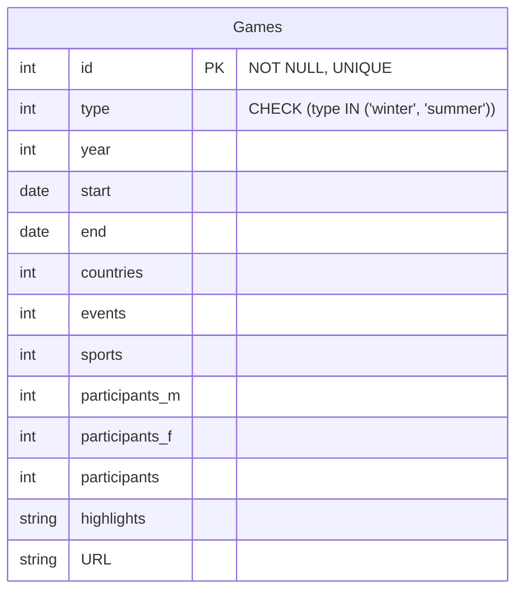
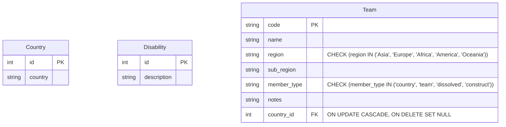

# 4. Object relational mapping (ORM)

So far you have learned:

- how to access and manipulate data in a pandas DataFrame
- how to create a database with sqlite3 and SQL statements, and how to add data (if you completed optional activities in
  week 3)
- how to create a Python class

You can use the values from a DataFrame or the results of a sqlite3 query to create instances of Python classes.
However, this often involves a lot of code and requires you to know both SQL and Python.

To simplify this process, many applications use a technique called Object-Relational Mapping (ORM). ORM lets you
interact with a database—like SQLite—using Python objects, so you don’t have to write raw SQL queries. Python libraries
such as [SQLAlchemy](https://docs.sqlalchemy.org/en/20/) and [SQLModel](https://sqlmodel.tiangolo.com/) aim to make
database operations more intuitive and help keep your code cleaner and easier to maintain.

Previously, COMP0035 taught SQLAlchemy. While powerful, SQLAlchemy's complexity can be challenging for beginners. This
year, we will use SQLModel instead.

SQLModel is a newer Python library designed to make working with SQL databases in Python easier and more intuitive. It
uses Python type annotations and is built on top of Pydantic and SQLAlchemy.

For example, in week 3, you designed the Paralympic Games table as follows:



With SQLModel, you can write a Python class that directly maps to this table. SQLModel can even generate the database
tables from your class definitions (we will cover this later).

Just like with Pydantic, SQLModel classes are called **models**.

To create a class with SQLModel you inherit the SQLModel class. Since SQLModel is built on pydantic and SQLAlchemy, you
do not need to inherit pydantic BaseModel as well.

Where the class maps to a database table then you include `table=True` to indicate this.

The attributes are defined similarly to pydantic. The Field() class can optionally be used to define the attributes to
indicate constrains such as key fields and other validation rules.

```python
from datetime import date

from sqlmodel import Field, SQLModel


class Games(SQLModel, table=True):
    id: int | None = Field(default=None, primary_key=True)
    type: str = Field()
    year: int
    start: date
    end: date
    countries: int
    events: int
    sports: int
    participants_m: int
    participants_f: int
    participants: int
    highlights: str
    URL: str

```

Inside the SQL database, the PK is always required and can't be NULL. Why declare it with `int | None`?

The `id` will be generated by the database, not by your code.

So, whenever you create an instance of this class, you will not set the `id`. The value of `id` will be `None` until it
is saved in the database, and then it will finally have a value that the database will assign.

## Activity: Write SQLModel classes

1. Create a copy of [starter_sqlmodel.py](../../src/activities/starter/starter_sqlmodel.py) and name it `models.py`. The
   name is not crucial but is a name you will see used often when you start to create web apps using the SQLModel
   classes.
2. Write SQLModel classes for the following tables:



You will likely need to refer to [SQLModel documentation](https://sqlmodel.tiangolo.com/tutorial/create-db-and-table/#create-the-table-model-class).

[Next activity](5-05-sqlmodel-create-db.md)