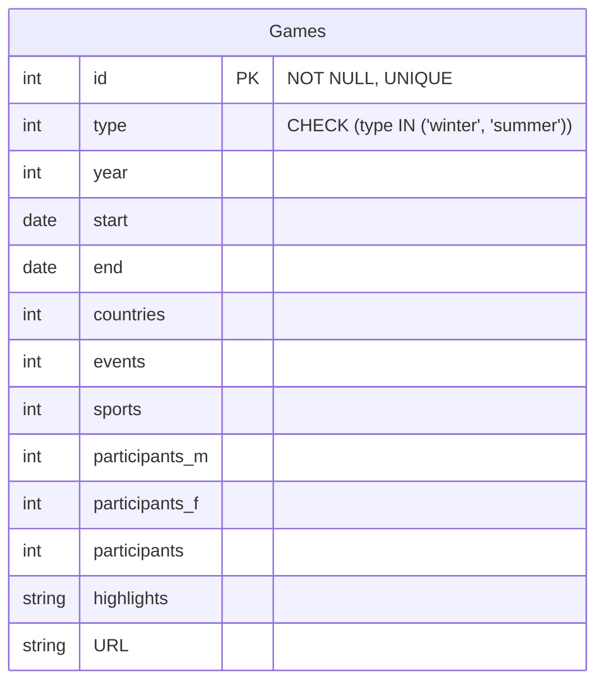
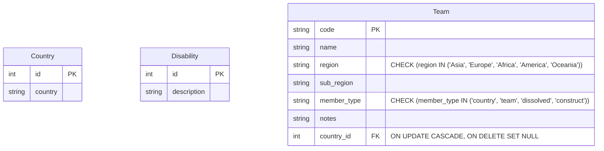

# 4. Object relational mapping (ORM)

So far you have learned how to:

- access and manipulate data in a pandas DataFrame
- create a database with sqlite3 and SQL statements, and how to add data (if you completed optional activities in
  week 3)
- create a Python class

You can use the values from a DataFrame or results from a sqlite3 query to create instances of Python classes.
However, this often involves a lot of manual code and requires knowledge of both SQL and Python.

Object-Relational Mapping (ORM) is a technique that lets you interact with a database using Python objects, so you don’t
have to write raw SQL queries.

Popular Python ORM libraries include:

- [SQLAlchemy](https://docs.sqlalchemy.org/en/20/)
- [SQLModel](https://sqlmodel.tiangolo.com/)

The libraries aim to make database operations more intuitive and help keep your code cleaner and easier to maintain.

Previously, COMP0035 used SQLAlchemy. While powerful, it can be complex for beginners. This year, we will use SQLModel
instead. SQLModel, which is built on top of Pydantic and SQLAlchemy, uses Python type annotations for simplicity.

For example, in week 3, you designed the Paralympic Games table like this:



As with Pydantic, SQLModel classes are referred to as **models**. Using SQLModel, a Python model class that directly
maps to the Games table could be written like this:

```python
from datetime import date

from sqlmodel import Field, SQLModel


class Games(SQLModel, table=True):
    id: int | None = Field(default=None, primary_key=True)
    type: str = Field()
    year: int
    start: date
    end: date
    countries: int
    events: int
    sports: int
    participants_m: int
    participants_f: int
    participants: int
    highlights: str
    URL: str

```

Key concepts:

- `class Games(SQLModel, table=True):` - inherit the SQLModel class. SQLModel inherits Pydantic BaseModel and SQLAlchemy
  so implicitly inherit these when you inherit SQLModel.
  `table=True` indicates that this class also defines a database table.
- attributes are defined similarly to pydantic. The `Field()` class can optionally be used to define the attributes to
  indicate constrains such as key fields and other validation rules.
- `int | None`: a PK is always required and can't be NULL so why declare it as optional? The `id` is generated by the
  database, not by your code. When you create an instance of the class, `id` will be `None` until the object is saved to
  the database and the database assigns a value.

## Activity: Write SQLModel classes

1. Create a copy of [starter_sqlmodel.py](../../src/activities/starter/starter_sqlmodel.py) and name it `models.py`. The
   name is not crucial but is a name you will see used often when you start to create web apps using the SQLModel
   classes.
2. Write SQLModel classes for the following tables:



You may want to refer
to
the [SQLModel tutorial](https://sqlmodel.tiangolo.com/tutorial/create-db-and-table/#create-the-table-model-class)
for help.

[Next activity](5-05-sqlmodel-create-db.md)