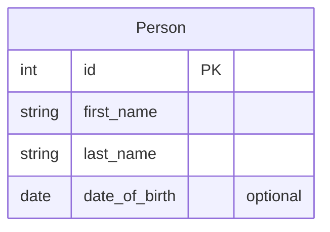
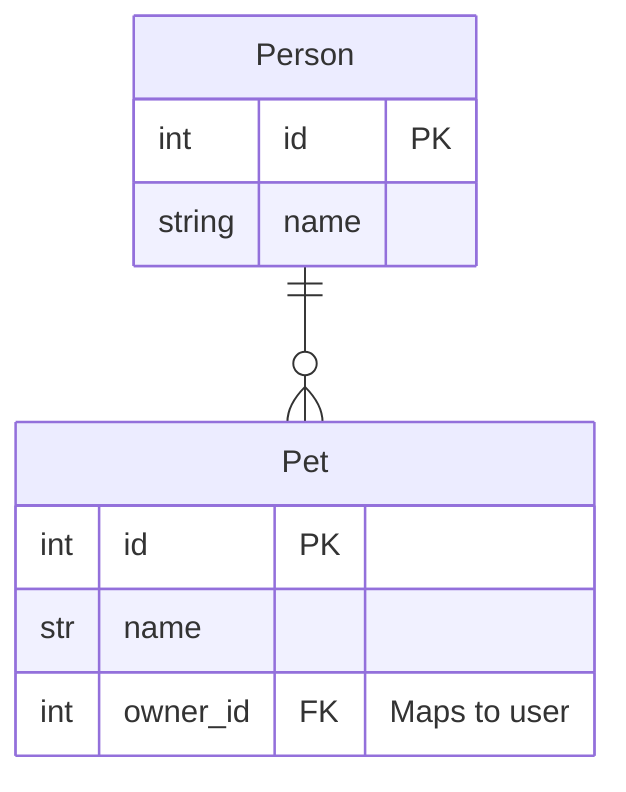

# 8 Optional: Using SQLAlchemy instead of SQLModel

For the coursework you can use SQLAlchemy instead of SQLModel, particularly if you already know SQLAlchemy.

## Define a SQLAlchemy model class

SQLAlchemy supports different syntax
or [styles of mapping Python classes to database tables](https://docs.sqlalchemy.org/en/20/orm/mapping_styles.html):
declarative style or imperative style. Imperative style is the original syntax and is used in some older tutorials. The
declarative style can also be used with Python type annotations.

The following are examples so you recognise the differences.

#### Declarative (with type annotations)

First
the [declarative style](https://docs.sqlalchemy.org/en/20/orm/declarative_tables.html#declarative-table-with-mapped-column).

This is used in many recent tutorials and is used the COMP0035 teaching activities.

```python
from typing import Optional
from sqlalchemy import Integer, String, ForeignKey
from sqlalchemy.orm import DeclarativeBase, Mapped, mapped_column


# Create a declarative base class
class Base(DeclarativeBase):
    pass


# An example class using mapping. The class inherits the Base class.
class User(Base):
    __tablename__ = "user"

    id: Mapped[int] = mapped_column(primary_key=True)
    name: Mapped[str] = mapped_column(String(50))
    fullname: Mapped[Optional[str]]
```

#### Declarative (without type annotation)

```python
from sqlalchemy import Integer, String
from sqlalchemy.orm import DeclarativeBase, mapped_column


class Base(DeclarativeBase):
    pass


class User(Base):
    __tablename__ = "user"

    id = mapped_column(Integer, primary_key=True)
    name = mapped_column(String(50), nullable=False)
    fullname = mapped_column(String)
```

You may also see the following style which defines the columns using `Column` which does not support all the 
configuration that `mapped_column` does.

```python
from sqlalchemy import Column, Integer, String
from sqlalchemy.orm import declarative_base

# Define the base sqlalchemy class you will inherit in your models using declarative style
Base = declarative_base()


class User(Base):
    __tablename__ = 'users'
    id = Column(Integer, primary_key=True)
    name = Column(String)
```

#### Imperative

```python
from sqlalchemy import Table, Column, Integer, String, ForeignKey
from sqlalchemy.orm import registry

mapper_registry = registry()

user_table = Table(
    "user",
    mapper_registry.metadata,
    Column("id", Integer, primary_key=True),
    Column("name", String(50)),
    Column("fullname", String(50)),
)


class User:
    pass


mapper_registry.map_imperatively(User, user_table)
```

### Activity: Define a sqlalchemy model class

Use a declarative style and write a model class for **Person**:



You will need the following syntax:

- Declare the base class:

    ```python
    class Base(DeclarativeBase):
        pass
    ```
- `def ClassName(Base):` inherit the base when you define your class
- `__tablename__='class_name''` define the table name. This is optional, if ou don't specify it will default to the
  class name in lowercase.
- `id = mapped_column(Integer, primary_key=True)` for a PK field
- `name: Mapped[str] = mapped_column(String(50), nullable=True)` for a non-key field. `nullable=True` denotes an
  optional field, i.e. one that can have a null value, `nullable=False` means a value is required and prevents null.

## Relationships

Consider that a person may have one or more pets:



To define relationships you define the ForeignKey field e.g. `owner_id = mapped_column(ForeignKey("person.id"))`

You can also define a relationship using `sqlalchemy.orm.relationship` that lets the Person know which Pets they own,
and each Pet know who its owner (Person) is.

This is an example from the SQLAlchemy documentation showing how to define this for a User with Addresses (email
address).

```python
from __future__ import annotations
from typing import List

from sqlalchemy import ForeignKey, Integer, String
from sqlalchemy.orm import DeclarativeBase, Mapped, mapped_column, relationship


class Base(DeclarativeBase):
    pass


class User(Base):
    __tablename__ = "user"

    id = mapped_column(Integer, primary_key=True)
    name: Mapped[str]
    # Relationship
    addresses: Mapped[List["Address"]] = relationship(back_populates="user")


class Address(Base):
    __tablename__ = "address"

    id = mapped_column(Integer, primary_key=True)
    user_id = mapped_column(ForeignKey("user.id"))
    email_address: Mapped[str]
    # Relationship
    user: Mapped["User"] = relationship(back_populates="addresses")
```

### Activity: add Pets table and relationships

1. Define the pet table and add the id from the Person table as a foreign key attribute.
2. Add a relationship to Person that is a list of Pet objects associated with them.
3. Add a relationship to Pet that is a single Person object associated with them.

## Create a database using the tables

This is similar to the SQLModel approach, create an [engine](https://docs.sqlalchemy.org/en/20/core/engines.html) to
access the [sqlite database file](https://docs.sqlalchemy.org/en/20/core/engines.html#sqlite) and use the [
`create_all()` method](https://docs.sqlalchemy.org/en/20/core/metadata.html#sqlalchemy.schema.MetaData.create_all) to
create all the model classes.

The model classes need to either be imported before the `create_all()` is called, or be in the same code file as the
`create_all()` code.

```python
from sqlalchemy import create_engine, MetaData

# import the models if not in the same file
# import the Base class you declared if not in the same file

# an Engine to connect to the database (this points to a path in the current directory)
engine = create_engine("sqlite:///pets.db")

# create the tables that are defined in the schema
Base.metadata.create_all(engine)
```

### Activity: create the database

Add the code to create the database.

You can either add this to the same file as the model classes, or create a new file with the code that creates the
database. If you choose the latter route, don't forget to import the models and the Base class before you call
`create_all()`.

## Add data

This is similar to the SQLModel pattern in activity 6.

Create the objects, then use
the [session to add](https://docs.sqlalchemy.org/en/20/orm/session_basics.html#adding-new-or-existing-items) them to the
database.

For example:

```python
from sqlalchemy.orm import Session
from sqlalchemy import create_engine

# Create an object
hero = User(username="Deadpond")

# Create an engine with the url of the database
engine = create_engine("sqlite:///database.db")

# Create a session
with Session(engine) as session:
    # Add the object
    session.add(hero)
    session.commit()
```

Where you have a relationship then you can add the related object through the relationship.

For example:

```python
user = User(username="joebloggs")
email_address = Address(email="jo@bloggs.com")
# Associate the user with this email address using the 'addresses' relationship attribute. Since they can have many addresses this is a list of addresses so you can append to the list.
user.addresses.append(email_address)

with Session(engine) as session:
    # Adding the user object also adds the associatred email_address
    session.add(user)
    session.commit()
```

### Activity: Add a person and their pet to the database

Write code to:

1. Create a person object
2. Create a pet object
3. Append the pet to the 'pets' relationship of the person
4. Add the person in the session and commit
