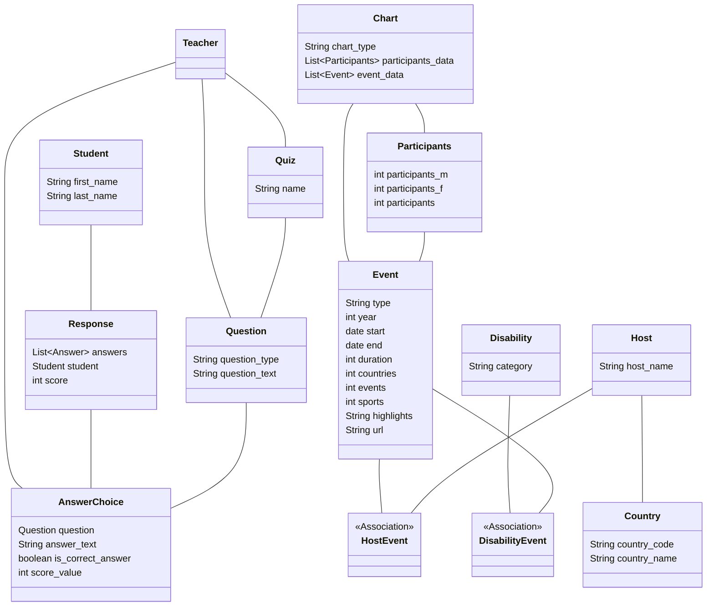
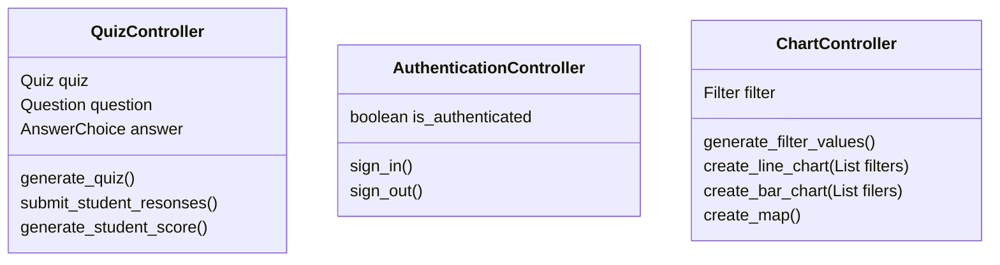
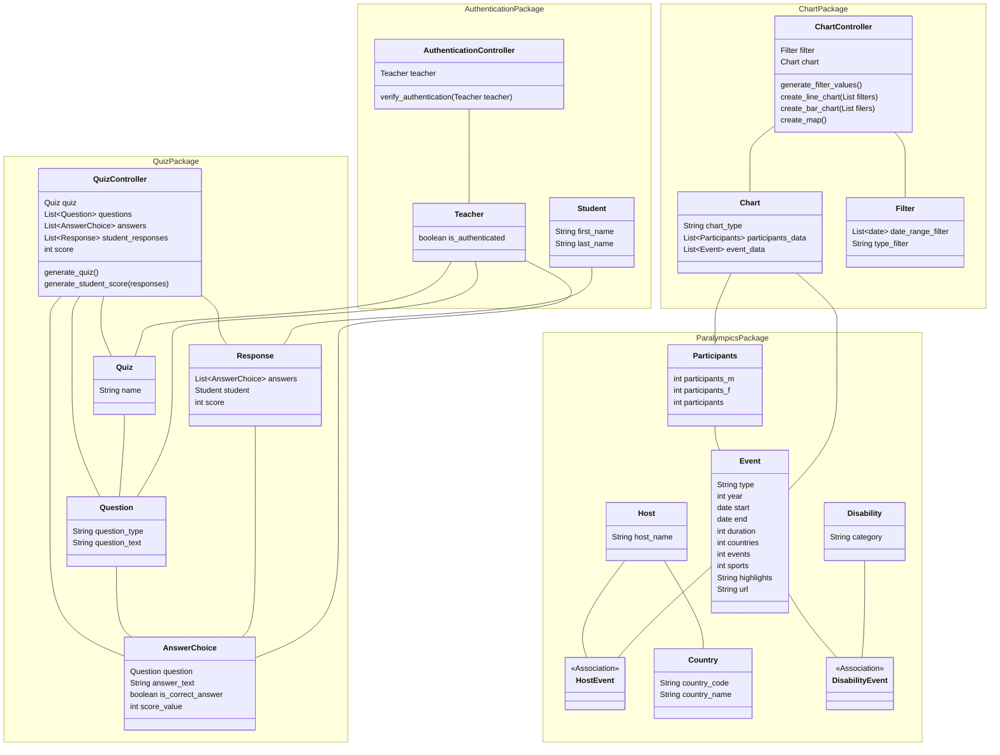

# 3. Determine the application structure

Model-View-Controller (MVC) MVC is a common design pattern for web applications. This activity assumes a decision has been made to structure the 
app in accordance with the MVC pattern. You are not required to follow this pattern in your coursework. It is used here for
speed in the tutorial, so you don't have to start from a blank sheet in determining the app structure.

## MVC design pattern

The goal of the MVC design pattern is to separate concerns in a web application:

- the **model** handles data and business logic,
- the **view** manages the user interface and presentation,
- and the **controller** acts as an intermediary between them.

Key concepts:

**Routes and controllers**

Each _route_ in a web app has a _controller_ action. When a user entera a URL, the application attempts to match it to a
defined route, and, if successful, calls that route's controller action. The controller typically:
- Retrieves data from the model (e.g., via a database)
- Passes that data to a view, which renders the page

**Models** 

Represent the data and its associated logic. They interact with the database and determine what data is
sent to the controller. You have already seen the ORM data mapper pattern to map between these model classes and the
database tables.

**Views**

In the view, the data is accessed and the information contained within is used to render the HTML content of
the page the user ultimately sees in their browser. You already designed the views as wireframes.

## Diagram format

This activity is loosely based on the UML class diagram format. This is not the only choice of diagram.

[Mermaid](https://mermaid.js.org/ecosystem/tutorials.html) is used as you likely installed to view the database
diagrams. If not, you may need to view these activities on GitHub.

Remember the following symbols for classes and relationships:

## Add the model classes

The following were derived from the ERD and the activities to identify classes from the user stories.

## Add the controller classes

These control the business logic. I have grouped them according to function; you may choose a different way to group
them. There is no single way to design these!

If not following the MVC model, these operations may be in the relevant model classes.

The logic to create, read, update and delete any of the model classes will be handled by the ORM, so has not been added
here. You can add them to the class diagram if you prefer.

## Add all the classes to the class diagram and add the relationships

The 'view' classes have been omitted in the diagram below. In the coursework you have represented these with the
wireframes.

You may not agree with this diagram, you may have made different choices to structure it differently.

This version also groups the Python classes into Python packages. This is not required.

[Next activity](7-05-review-design.md)