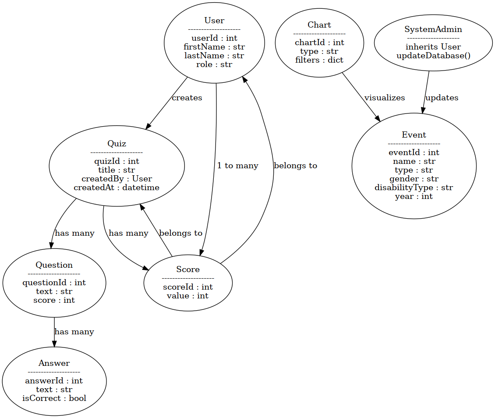
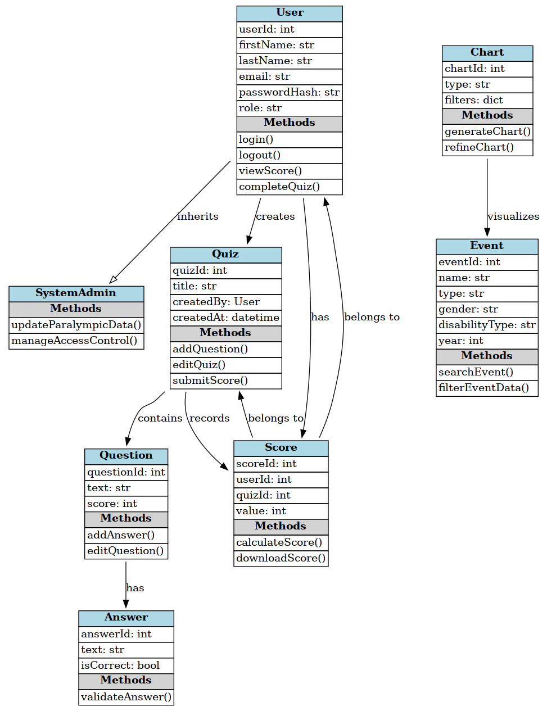
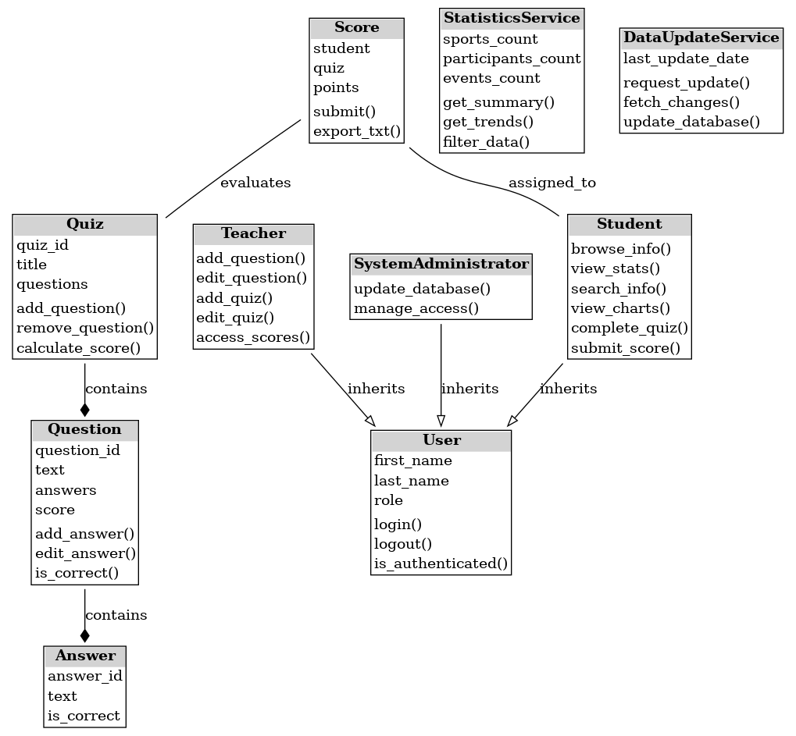
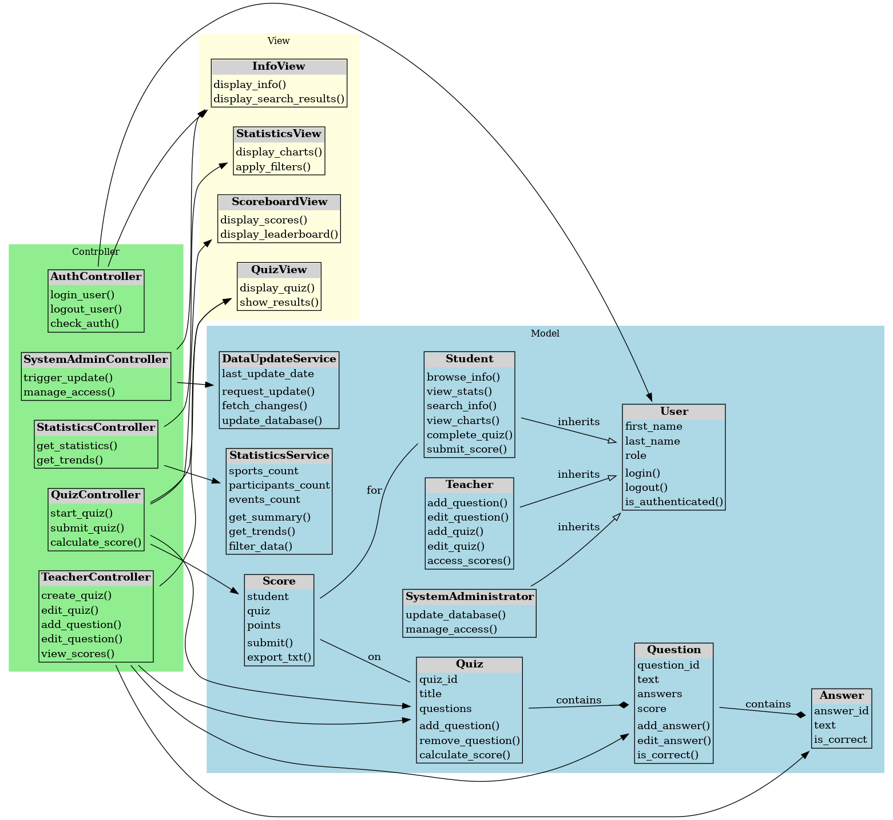

# 7. Generative AI in application design

Note: this activity was created 25/09/25. Repeating the activity will likely give a different result.

## Tools used

The following tools were tried in relation to this week's activities:

- [Goblin Tools professor](https://goblin.tools/Professor) - for summary explanations of design concepts. Prompts used:

    - `Explain the DRY design principle`
    - `Explain the low coupling design principle`
    - `Explain the high cohesion design principle`
    - `Explain the purpose of a UML class diagram`
    - The responses generated at the time were concise and consistent with teaching materials. Responses were
      illustrated with an example.
- [Microsoft copilot - accessed using UCL account](https://copilot.microsoft.com)

    - The prompt used was: `generate a class diagram from the attached user stories`
      with [user-stories.md](7-08-user-stories.md) attached.
    - The response is below and includes classes and attributes, and relationships. It did not identify class
      operations (functions). I entered a subsequent prompt `add methods to all classes`
    - A following prompt was then entered:
      `To what extent does this class diagram meet the principles of low coupling and high cohesion?` and again the
      response is below.
- [ChatGPT - free 'everyday tasks' version](https://chatgpt.com)

    - the same prompt was used as for copilot. The result included methods as well as classes and attributes,
      and relationships between classes.
    - ChatGPT offered to draw this as a diagram, but the result was not meaningful.
    - A second prompt was used:
      `To what extent does this class diagram meet the principles of low coupling and high cohesion?`. The response to
      this was detailed and is included below.
    - A third prompt was used:
      `Modify the design so that it is consistent with the model view controller design pattern`. Again, the response is
      below.

As a learning outcome, it is recommended that you first attempt the activities without using gen AI tools as you need to
learn the technique before you can critically judge the output of a gen AI tool. Comparing your own work to the response
of a gen AI tool may give suggested areas where you could review your design.

## copilot response

### Key Classes and Relationships

1. User

   Attributes: userId, firstName, lastName, role (Student, Teacher, Admin)

   Relationships:
    - A User can complete many Quizzes
    - A Teacher can create/edit Questions and Quizzes
    - A User has many Scores
2. Quiz

   Attributes: quizId, title, createdBy, createdAt

   Relationships:
    - A Quiz has many Questions
    - A Quiz has many Scores
3. Question
   Attributes: questionId, text, score
   Relationships:
    - A Question can belong to many Quizzes
    - A Question has many Answers
4. Answer

   Attributes: answerId, text, isCorrect

   Relationships:
    - Belongs to one Question
5. Score
   Attributes: scoreId, userId, quizId, value
   Relationships:
    - Belongs to one User and one Quiz
6. Event

   Attributes: eventId, name, type (Summer/Winter), gender, disabilityType, year

   Relationships:
    - Used for browsing, searching, and charting
7. Chart

   Attributes: chartId, type (line, bar, map), filters

   Relationships:
    - Uses data from Event
8. SystemAdmin

   Inherits from User

   Responsibilities:
    - Update Paralympic data via API
    - Manage authentication and access control

Here is the UML class diagram generated from the user stories in your file. It models the key entities and their
relationships in the quiz and Paralympic data system:



Version after methods were added:



**Note** This is a Java style naming convention, not Python.

### Critically review the design (copilot)

#### High Cohesion

Cohesion refers to how closely related the responsibilities of a class are.

- User class: Contains attributes and methods directly related to user identity and actions (e.g. login(), viewScore(),
  completeQuiz()), which is cohesive.
  Quiz, Question, and Answer classes: Each focuses on a single concept — managing quizzes, questions, and answers
  respectively. Their methods (e.g. addQuestion(), editQuestion()) are tightly related to their core purpose.
- Score: Manages scoring logic and data, with methods like calculateScore() and downloadScore() — again, cohesive.
- Event and Chart: These are focused on data visualisation and filtering, which keeps their responsibilities
  well-defined.

- Conclusion: Most classes have a clear, focused purpose, which supports high cohesion.

#### ✅/⚠️ Low Coupling

Coupling refers to how dependent classes are on each other.

Positive signs:

- Relationships like User → Quiz and Quiz → Question are necessary and logical.
- Use of identifiers (e.g. userId, quizId) in Score helps decouple it from direct object references.
- SystemAdmin inherits from User, which is appropriate given shared attributes and methods.

Areas to watch:

- If Quiz directly holds User objects (createdBy: User), this could increase coupling. Using just userId or a service
  layer would reduce dependency.
- Chart depends on Event data — this is acceptable, but if Chart directly manipulates Event objects, it could be tightly
  coupled. A data access layer or API abstraction could help.

Conclusion: Coupling is generally low but could be improved by abstracting direct object references where possible.

##### 🛠️ Suggestions for Improvement

- Introduce interfaces or service classes for operations like authentication, data updates, and chart generation.
- Use dependency injection or data transfer objects (DTOs) to reduce direct dependencies between classes.
- Consider separating data access from business logic to further reduce coupling.

## chatgpt response

Prompt: `Generate a class diagram from the attached user stories. Include methods. Use Python style naming convention.`

The response was a diagram. Note that this is clearly an AI-generated diagram since a person is unlikely to create a
diagram using a cumbersome method of typing `+----` etc. in the terminal.

```
+--------------------+
| User               |
+--------------------+
| first_name         |
| last_name          |
| role               |  # "student", "teacher", "admin"
+--------------------+
| login()            |
| logout()           |
| is_authenticated() |
+--------------------+

            ▲
            |
   +-----------------+
   | Student         |
   +-----------------+
   | browse_info()   |
   | view_stats()    |
   | search_info()   |
   | view_charts()   |
   | complete_quiz() |
   | submit_score()  |
   +-----------------+

   +-----------------+
   | Teacher         |
   +-----------------+
   | add_question()  |
   | edit_question() |
   | add_quiz()      |
   | edit_quiz()     |
   | access_scores() |
   +-----------------+

   +----------------------+
   | SystemAdministrator  |
   +----------------------+
   | update_database()    |
   | manage_access()      |
   +----------------------+

+----------------------+
| Quiz                 |
+----------------------+
| quiz_id              |
| title                |
| questions            |  # list of Question
+----------------------+
| add_question(q)      |
| remove_question(q)   |
| calculate_score()    |
+----------------------+

+----------------------+
| Question             |
+----------------------+
| question_id          |
| text                 |
| answers              |  # list of Answer
| score                |
+----------------------+
| add_answer(a)        |
| edit_answer(a)       |
| is_correct(a)        |
+----------------------+

+----------------------+
| Answer               |
+----------------------+
| answer_id            |
| text                 |
| is_correct           |
+----------------------+

+----------------------+
| Score                |
+----------------------+
| student              |
| quiz                 |
| points               |
+----------------------+
| submit()             |
| export_txt()         |
+----------------------+

+----------------------+
| StatisticsService    |
+----------------------+
| sports_count         |
| participants_count   |
| events_count         |
+----------------------+
| get_summary()        |
| get_trends()         |
| filter_data()        |
+----------------------+

+----------------------+
| DataUpdateService    |
+----------------------+
| last_update_date     |
+----------------------+
| request_update()     |
| fetch_changes()      |
| update_database()    |
+----------------------+

```

It also created an image file:



### Critically review the design

The response to the prompt
`To what extent does this class diagram meet the principles of low coupling and high cohesion?` was:

🔹 Low Coupling

Coupling refers to how dependent classes are on each other.

- Strengths:
    - The diagram separates responsibilities into distinct domains:
        - User hierarchy for authentication and roles.
        - Quiz, Question, Answer, Score for assessment.
        - StatisticsService and DataUpdateService as independent services.

    - Associations use composition/aggregation (e.g. Quiz contains Question, Question contains Answer), which is
      natural and minimal.
    - Services (StatisticsService, DataUpdateService) are not entangled with User or Quiz objects, reducing
      dependencies.

- Potential Coupling Issues:
    - Score depends on both Student and Quiz, creating multiple links. This is acceptable since 'score' logically ties
      both, but it increases coupling.
    - If the statistics service directly queried Quiz or Score objects rather than being an independent data layer,
      coupling could grow.

✅ Overall: Coupling is relatively low, though further separation of persistence concerns (repositories, data access
layer) would reduce dependencies further.

🔹 High Cohesion

Cohesion means each class has a single, well-defined responsibility.

- Strengths:
    - User and its subclasses (Student, Teacher, SystemAdministrator) are cohesive, each handling role-specific actions.
    - Quiz, Question, Answer follow the single responsibility principle: each models one domain concept.
    - StatisticsService only handles data summaries and trends, keeping analytics separate from quiz logic.
    - DataUpdateService only handles API syncing and updates.

- Potential Cohesion Issues:
    - Student has a broad set of methods (browse info, view stats, search info, complete quiz, submit score). This may
      indicate multiple concerns — browsing/statistics might be better encapsulated in a ParalympicsInfoService instead
      of inside Student.
    - Teacher has both quiz management and score access. If expanded, score management could be separated into a
      ScoreService.

✅ Overall: Cohesion is quite high, though Student and Teacher could benefit from delegating responsibilities to service
classes for cleaner separation.

⚖️ Summary

- Low Coupling: Achieved by clear separation of users, quizzes, and services. Slightly weakened by Score being tied to
  both Student and Quiz.
- High Cohesion: Generally good, though Student and Teacher risk becoming "God classes" if more features are added.
  Extracting browsing/statistics into dedicated services would improve cohesion.

👉 On balance: The diagram meets the principles well, but refinement is possible to further reduce coupling and
strengthen cohesion.

Would you like me to refactor the diagram to show an improved version (e.g. moving browsing/stats into a
ParalympicsInfoService, and score handling into a ScoreService)?

## Modify the design to conform to MVC

Prompt: `Refactor the design to the model view controller design pattern`

Perfect — let’s **refactor the design into MVC (Model–View–Controller)**.

The idea is:

* **Model** → domain entities (data & business logic).
* **View** → user-facing components (e.g., web/mobile UI, charts, quiz screens).
* **Controller** → orchestrates between views and models, processes input, enforces rules.

---

## 🔹 Refactored MVC Design

### **Model (Data & Business Logic)**

* `User` (abstract), `Student`, `Teacher`, `SystemAdministrator`
* `Quiz`, `Question`, `Answer`, `Score`
* `StatisticsService` (business logic for trends, filtering)
* `DataUpdateService` (synchronisation with API)

---

### **View (UI / Presentation Layer)**

* `QuizView` → displays quizzes, questions, and answers.
* `ScoreboardView` → shows scores, rankings, leaderboards.
* `StatisticsView` → charts, filters, trends.
* `InfoView` → browsing/searching Paralympics data.

*(Views are passive — they render data provided by controllers.)*

---

### **Controller (Application Logic)**

* `AuthController` → login/logout/authentication.
* `QuizController` → manages quiz taking, submission, and grading.
* `TeacherController` → quiz/question editing, score access.
* `StatisticsController` → interacts with `StatisticsService` to provide data to views.
* `SystemAdminController` → handles database updates via `DataUpdateService`.

---

## 🔹 UML Class Diagram (Textual)

```
                +----------------------+
                |        Model         |
                +----------------------+
  User <|-- Student
  User <|-- Teacher
  User <|-- SystemAdministrator
  Quiz *-- Question *-- Answer
  Score --> Student
  Score --> Quiz
  StatisticsService
  DataUpdateService

                +----------------------+
                |        View          |
                +----------------------+
  QuizView
  ScoreboardView
  StatisticsView
  InfoView

                +----------------------+
                |     Controller       |
                +----------------------+
  AuthController --> User
  QuizController --> Quiz, Score
  TeacherController --> Quiz, Question, Answer
  StatisticsController --> StatisticsService
  SystemAdminController --> DataUpdateService
```

---

## 🔹 Improvements from MVC Alignment

* **Low coupling**:

    * Views do not directly manipulate models — they go through controllers.
    * Services (`StatisticsService`, `DataUpdateService`) remain in the model layer, decoupled from views.
* **High cohesion**:

    * Each controller is focused on a single use case (auth, quiz, teacher, stats, admin).
    * Views only render; models only handle domain logic.

---

Would you like me to **generate an updated visual UML diagram** (PNG/SVG) with the MVC separation (Models, Views,
Controllers grouped) so it’s easier to present in documentation?


Subsequent prompt to add attributes and methods:


