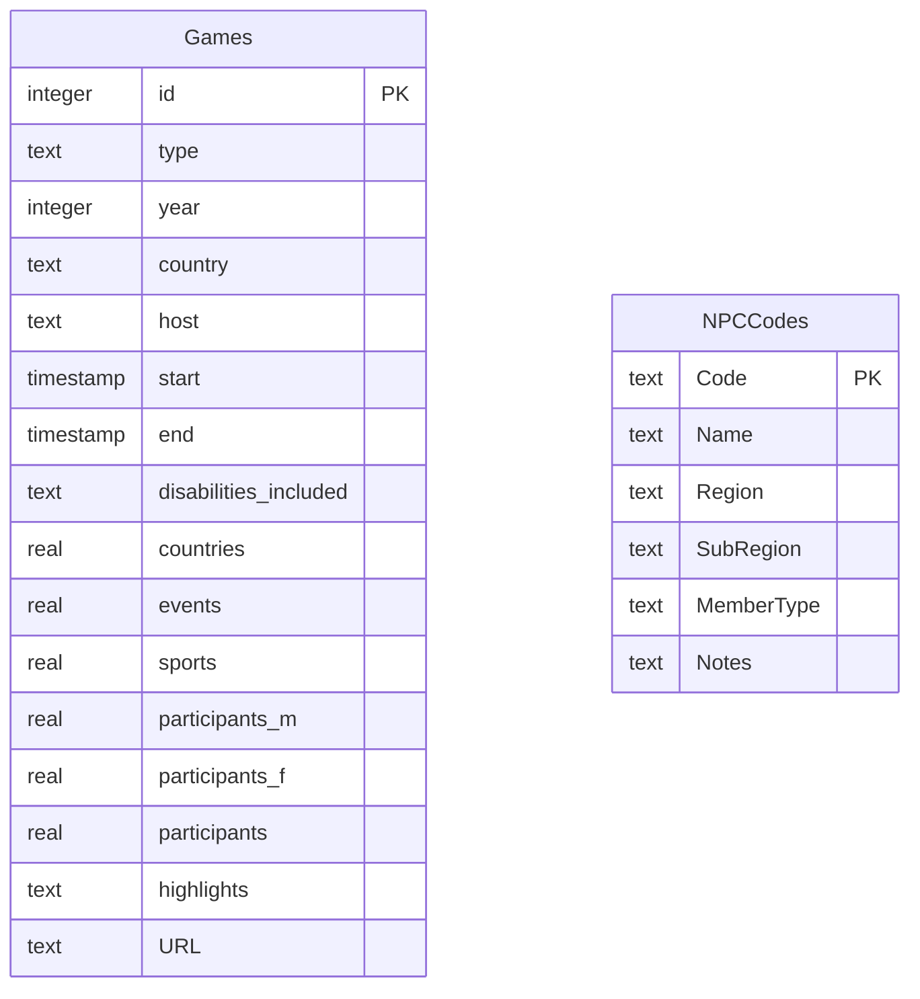
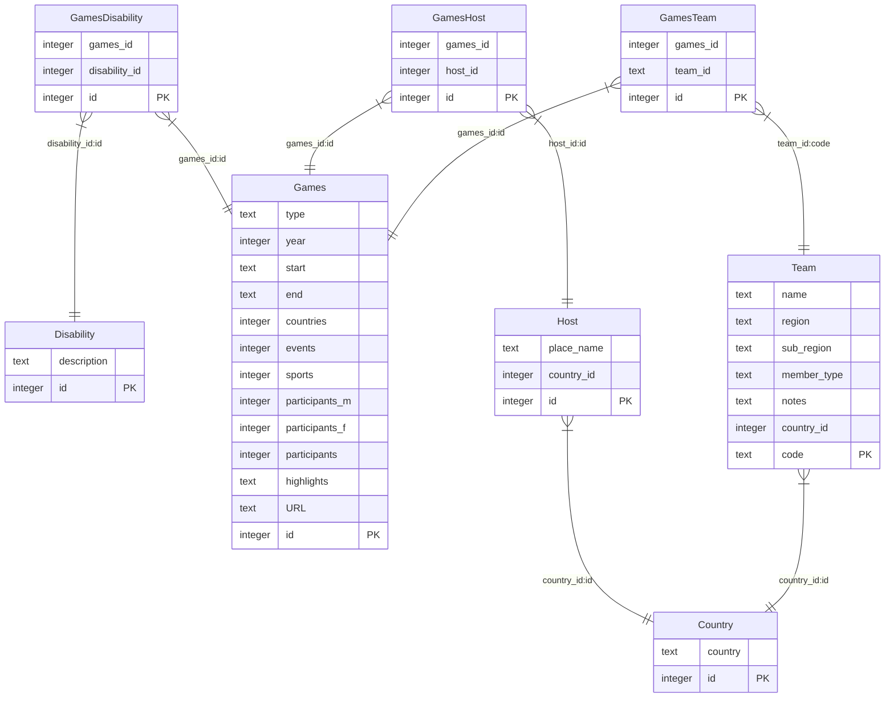

# Optional: Query complexity comparisons

Over the last few weeks in the tutorial sessions, students have asked about the impact of normalisation when it comes to
programming queries. This activity uses two extreme versions of the paralympics database to allow you to experience
the differences.

Using a database that is **not** normalised **not recommended**, please do not do this in your coursework. Normalisation
aims to reduce redundancy and increase data integrity.

## Databases

### Un-normalised ERD

[para-not-normalised.sqlite](../../src/activities/data/para-not-normalised.sqlite)

### Normalised ERD

[para-normalised.db](../../src/activities/data/para-normalised.db)

## Activity

Try to write solutions to each of the following using both versions of the database.

Use SQLModel to write the queries. Please try at least 1 select and 1 update query.

Reflect on the implications for query complexity and data integrity.

1. List all Paralympics (games) with their year and type.
2. List all winter Paralympics (games) and include: host, year, number of participants.
3. Find all disabilities recorded in the database.
4. Get all Paralympics (Games) that took place after the year 2000.
5. Find all teams from a specific country (e.g. Canada).
6. List all hosts located in a specific country (e.g., 'Japan') and the year they held the Paralympics.
7. Show all Paralympics (games) along with their host city and host country.
8. List all disabilities associated with each Paralympics (games).
9. Find all teams that participated in a specific Paralympics (game) (e.g., Tokyo 2016).
10. Find all the Paralympics that have competitors who are 'Amputees'
11. **Update** all instances of the disability 'Les Autres' to 'Other'

NB: Normalisation aims to reduce redundancy and increase data integrity. Queries in this exercise may seem quicker and
simpler using the database that has not been normalised, however, using a database that is not normalised is
**not recommended**, so please do not do this in your coursework.
