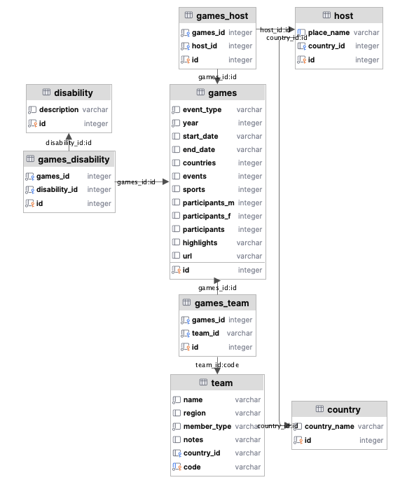
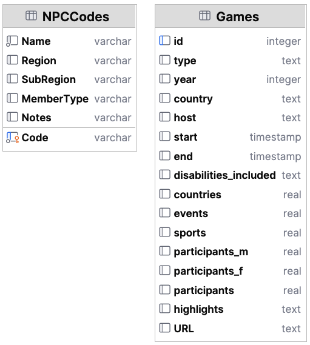

# Optional: Paralympics database queries with SQLModel

**Activity updated 27/11/25** In the tutorials we will demonstrate the use of SQLModel for a few of the queries.

## Activity 1: SQLModel queries for the paralympics database

The code is in [src/activities/starter/db_wk8/paralympics](../../src/activities/starter/db_wk8/paralympics)

```text
db_wk8_demo
    |_ app.py             # Runs the query code
    |_ database.py        # Creates the database
    |_ models.py          # SQLModel classes for the paralympics data
    |_ query_service.py   # Class that has the queries
    |_ data 
          |_ paralympics.db  # Version of the database for this activity, created using the models
```

The tutorial demo will cover:

- adding relationships to a SQLModel class
- adding methods to a SQLModel class
- basic CRUD queries for a single table
- select queries with joins

The queries are:

1. List all Paralympics (games) with their year and type.
2. List all winter Paralympics (games) with host name(s) and year.
3. Find all disabilities recorded in the database.
4. Get all Paralympics (Games) that took place after the year 2000.
5. Find all teams from a specific region (e.g. Oceania).
6. List all hosts located in a specific country (e.g., 'Italy') and the year they held the Paralympics.
7. Show all Paralympics (games) along with their host city and host country.
8. List all disabilities associated with each Paralympics (games).
9. Find all teams that participated in a specific Paralympics (game) (e.g., Tokyo 2016).
10. Find all the Paralympics that have competitors who are 'Amputees'
11. Update all instances of the disability 'Les Autres' to 'Other'

The database structure is as follows:



## Activity 2: Differences between more/less normalised databases

This activity uses an extreme version of the paralympics database that has not been normalised to allow you to
experience the differences in query complexity.

Using a database that has not been normalised **not recommended**, please do not do this in your coursework.
Normalisation is important to reduce redundancy and increase data integrity.

The database structure is as follows:



### Queries

Write the same queries, this time for the database that has not been normalised. Try to do at least one update query,
and one select query that has joins, to experience the differences. Reflect on the implications for query complexity and
data integrity.

There is starter code in [query_comparison.py](../../src/activities/starter/db_wk8/comparison/queries.py)

NB: Normalisation aims to reduce redundancy and increase data integrity. Select queries in this exercise may seem
quicker and simpler using the database that has not been normalised, however, using a database that is not normalised is
**not recommended**, please do not do this in your coursework.
