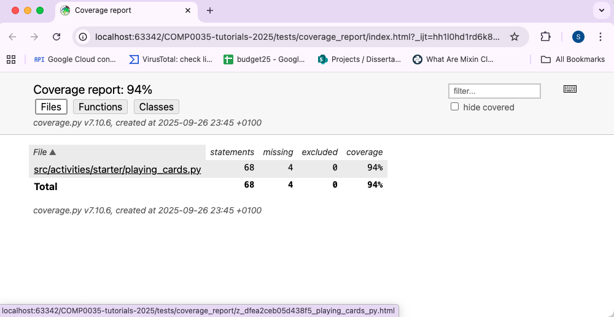
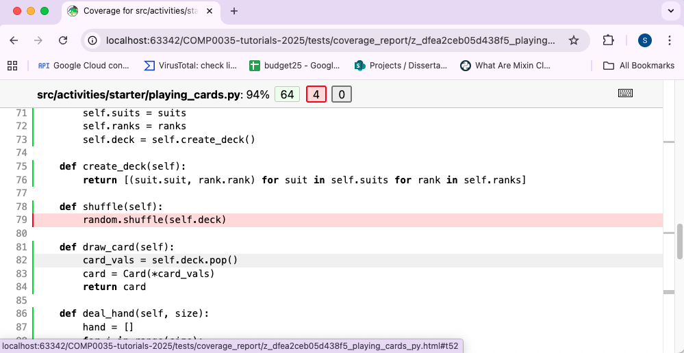

# 4. Coverage

## What is coverage?

In software testing, coverage refers to a metric that measures the extent to which the codebase is tested by a set of
test cases. It helps ensure that the tests are validating the functionality and quality of the software.

Theoretically, higher code coverage should correlate with fewer defects, but this depends on the quality and scope of
the tests. Unit testing alone is unlikely to be sufficient to catch all kinds of errors.

Aiming for 100% coverage is not usually practical due to the cost and time involved; and it may not be necessary
depending on the potential impact of system
failure. [This Google blog post](https://testing.googleblog.com/2020/08/code-coverage-best-practices.html)
provides a summary of the implications of coverage. In it, they suggest the following guidelines for their organisation:
> ... at Google we offer the general guidelines of 60% as "acceptable", 75% as "commendable" and 90% as "exemplary".

These guidelines are meaningful in their organisation for the scale, scope and nature of their applications. Other
organisations and situation will likely have different metrics. For
example, [sonar](https://www.sonarsource.com/resources/library/code-coverage/) suggest a "typically accepted goal" is
80%.

For coursework 2 your code base is very small in comparison to these examples, so achieving 100% is realistic.

## Python coverage tools

Tools that measure code coverage report their results to a specified output, such as the terminal, a text file, or an
HTML report.

Popular tools include:

- [`coverage.py`](https://pypi.org/project/coverage/) is a widely used Python coverage tool
- [`pytest-cov`](https://pypi.org/project/pytest-cov/) extends coverage with additional reporting.

These tools typically report on:

- Statement coverage: how many lines or statements in the codebase are executed by tests.
- Uncovered lines: identifying which lines of code are not exercised by any test.
- Branch coverage: evaluates whether all possible branches (e.g., paths through if statements) are tested. Branches
  represent different execution paths, and branch coverage shows how many of these are covered.

Some tools may also report on other types of coverage, such as function coverage or condition coverage, depending on
their capabilities.

## Pytest coverage using pytest-cov

Coverage can be configured to run within your IDE. Look in your IDE's documentation.

To run in the venv terminal, include coverage in the command to run pytest. The following would run pytest and produce a
coverage report to show how well any tests it finds cover the all the python code in the project. It reports the result
in the terminal.

```terminal
pytest -v --cov
```

Some of the options that can be specified include:

- `--cov=path_to_your_code` to specify what code should be included when assessing how far the tests cover it. Don't run
  coverage on the test code itself!
- `--cov-report=html:coverage_report` to specify the output format (`html`) and the folder name to generate the html
  to (coverage_report)
- `--cov-report=term-missing` specify the type of report, `term-missing` indicates code not covered (missed) by the
  tests
- `--cov-branch` report on branch coverage

## Activity: Report on coverage and assess the output

Run the tests you have written for this tutorial again with different options:

1. `pytest tests/test_playing_cards.py --cov`
2. `pytest tests/test_playing_cards.py --cov=activities.starter.playing_cards`
3. `pytest tests/test_playing_cards.py --cov-report=term-missing --cov=activities.starter.playing_cards`
4. `pytest tests/test_playing_cards.py --cov-report=html:tests/coverage_report --cov=activities.starter.playing_cards`

   After you run this, find the coverage_report folder that was created in tests/coverage_report. Find index.html and
   open in a browser. The file, function, class are hyperlinks and if you click through to a file, function or class not
   100% you will see the code that is not tested is highlighted.

   
   
5. `pytest tests/test_playing_cards.py --cov-branch --cov-report=term-missing --cov=activities.starter.playing_cards`

My thoughts on what the report contents give you:

1. 96% Report incorrectly includes the test code itself
2. 94% Only checks how far the tests written test the code in playing_cards.py which is more accurate than 1.
3. 94% As for 2, only now you also know which lines have not been tested 32, 79 and 109-110.
4. 94% As for 3 but more visually and easily lets you click through the HTML to find the code that is not tested.
5. 95% As for 2 but also shows how many branches are missed. Branch is a route through the code, so for example branches
   missed could one side of an if statement not executed.

Assessing tests solely on coverage % has limitations:

- High coverage doesn't guarantee good tests. You might have tests that execute code but don’t actually assert correct
  behavior.
- Coverage tools measure execution, not intent. They don’t know if your tests are checking edge cases, error handling,
  or business logic. You could have 100% coverage but miss critical scenarios.
- Coverage tools typically focus on unit tests. They don't measure whether components work together correctly (
  integration testing), or whether the system behaves as expected in real-world scenarios.
- If you only measure line coverage, you might miss untested branches (e.g., if/else paths). Branch coverage helps, but
  even that may not catch complex logical conditions or data-driven bugs.
- Some code (e.g., logging, trivial getters/setters) may not need tests. Trying to achieve 100% coverage can waste time
  on low-value tests.
- Developers could write superficial tests just to increase coverage.

In your coursework course try to be critical in reviewing coverage:

- If not 100% what code is not covered? Are critical functions and high-risk areas well-covered? Is it important to
  write tests to cover these?
- Have you considered edge cases? Error paths? Invalid inputs?
- Are your assertions and test cases meaningful?

[Next activity](9-05-ci-github.md)